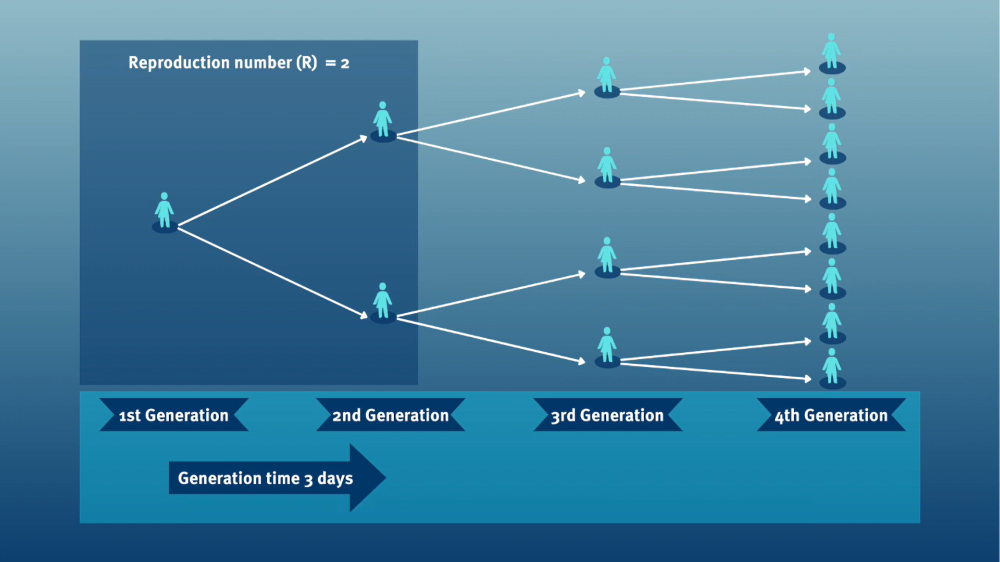

::: {.callout-note title="Perguntas"}

- Como obter acesso a distribuições de atraso de doenças a partir de uma base de dados pré-estabelecida para uso em análises?

:::

::: {.callout-tip title="Objetivos"}

- Obter atrasos a partir de uma base de dados de busca na literatura com o `{epiparameter}`.
- Obter parâmetros de distribuição e estatísticas resumo de distribuições de atraso.

:::

::: {.callout-important title="Pré-requisitos"}

## Pré-requisitos

Este episódio requer que você tenha familiaridade com:

**Ciência de dados** : Programação básica com R.

**Teoria epidêmica** : parâmetros epidemiológicos, períodos temporais de doenças, como período de incubação, tempo de geração e intervalo serial.

:::

## Introdução

As doenças infecciosas seguem um ciclo de infecção, que geralmente inclui as seguintes fases: período pré-sintomático, período sintomático e período de recuperação, conforme descrito por sua [história natural](../glossario.qmd#naturalhistory). Esses períodos de tempo podem ser usados para compreender a dinâmica de transmissão e orientar intervenções de prevenção e controle de doenças.

](../img/time-periods.jpg)

::: {.callout-note}

### Definições

Consulte o [glossário](../glossario.qmd) para as definições de todos os períodos de tempo da figura acima!

:::

No entanto, no início de uma epidemia, os esforços para compreender a epidemia e as implicações para o controle podem ser atrasados pela falta de uma maneira fácil de acessar parâmetros-chave para a doença de interesse ([Nash et al., 2023](https://mrc-ide.github.io/epireview/)). Projetos como `{epiparameter}` e [epireview](https://mrc-ide.github.io/epireview/) estão construindo catálogos online seguindo protocolos de síntese da literatura que podem ajudar a orientar análises e parametrizar modelos, fornecendo uma biblioteca de parâmetros epidemiológicos previamente estimados de surtos passados.

::: {.callout-important title="Para o instrutor" collapse="true"}

Modelos iniciais para a COVID-19 usaram parâmetros de outros coronavírus. <https://www.thelancet.com/article/S1473-3099(20)30144-4/fulltext>

:::

Para ilustrar como usar o pacote R `{epiparameter}` no seu pipeline de análise, nosso objetivo neste episódio será acessar um conjunto específico de parâmetros epidemiológicos da literatura, em vez de extraí-los de artigos e copiar e colar manualmente. Em seguida, vamos conectá-los a um fluxo de trabalho de análise do `{EpiNow2}`.

<!-- In this episode, we'll learn how to access one specific set of epidemiological parameters from the literature and then get their **summary statistics** using `{epiparameter}`.  -->

Vamos começar carregando o pacote `{epiparameter}`. Usaremos o pipe `%>%` para conectar algumas de suas funções e algumas funções do `{tibble}` e do `{dplyr}`, então vamos carregar também o pacote `{tidyverse}`:

```{r,warning=FALSE,message=FALSE}
library(epiparameter)
library(tidyverse)
```

::: {.callout-note title="Checklist"}

### O operador de dois-pontos duplos

O operador de dois-pontos duplos `::` no R permite que você chame uma função específica de um pacote sem carregar o pacote inteiro no ambiente atual. 

Por exemplo, `dplyr::filter(data, condition)` usa `filter()` do pacote `{dplyr}`.

Isso nos ajuda a lembrar as funções dos pacotes e a evitar conflitos de namespace.

:::

## O problema

Se quisermos estimar a transmissibilidade de uma infecção, é comum usar um pacote como o `{EpiEstim}` ou o `{EpiNow2}`. 

- O pacote `{EpiEstim}` permite a estimativa em tempo real do [número de reprodução](../glossario.qmd#effectiverepro) usando dados de casos ao longo do tempo, refletindo como a transmissão varia com base em quando os sintomas surgem. 

- Para estimar a transmissão com base em quando as pessoas foram de fato infectadas (em vez do início dos sintomas), o pacote `{EpiNow2}` estende essa ideia combinando-a com um modelo que leva em conta delays nos dados observados. 

Ambos os pacotes exigem algumas informações epidemiológicas como entrada. Por exemplo, no `{EpiNow2}` podemos usar `EpiNow2::Gamma()` para especificar um [tempo de geração](../glossario.qmd#generationtime) como uma distribuição de probabilidade Gamma adicionando sua média (`mean`), desvio padrão (`sd`) e valor máximo (`max`). 

Para especificar um `generation_time` que segue uma distribuição _Gamma_ com média $\mu = 4$, desvio padrão $\sigma = 2$ e um valor máximo de 20, escrevemos:

```r
generation_time <- 
  EpiNow2::Gamma(
    mean = 4,
    sd = 2,
    max = 20
  )
```

É uma prática comum entre analistas pesquisar manualmente a literatura disponível e copiar e colar as **estatísticas resumo** ou os **parâmetros da distribuição** de publicações científicas. Um desafio frequentemente enfrentado é que a apresentação de diferentes distribuições estatísticas não é consistente na literatura (por exemplo, um artigo pode relatar apenas a média, em vez de toda a distribuição subjacente). O objetivo do `{epiparameter}` é facilitar o acesso a estimativas confiáveis de parâmetros de distribuição para diversas doenças infecciosas, para que possam ser facilmente implementadas em pipelines de análise de surtos.

Neste episódio, vamos *acessar* as estatísticas resumo de um tempo de geração para COVID-19 a partir da biblioteca de parâmetros epidemiológicos fornecida pelo `{epiparameter}`. Essas métricas podem ser usadas para estimar a transmissibilidade dessa doença usando o `{EpiNow2}` nos episódios seguintes.

Vamos começar verificando quantas entradas estão atualmente disponíveis na **base de dados de distribuições epidemiológicas** do `{epiparameter}` usando `epiparameter_db()` para a distribuição epidemiológica `epi_name` chamada tempo de geração com a string `"generation"`:

```{r}
epiparameter::epiparameter_db(
  epi_name = "generation"
)
```

Na biblioteca de parâmetros epidemiológicos, pode ser que não tenhamos uma entrada de tempo de geração (`"generation"`) para a doença de interesse. Em vez disso, podemos consultar os intervalos seriais (`serial`) para COVID-19. Vamos descobrir o que precisamos considerar para isso!

::: {.callout-note}

### Dados de revisão sistemática para patógenos prioritários

O [pacote R `{epireview}`](https://mrc-ide.github.io/epireview/) possui parâmetros sobre Ebola, Marburg, Lassa, SARS, Zika e Nipah a partir de revisões sistemáticas recentes, com mais patógenos prioritários planejados para versões futuras. Dê uma olhada [nesta vinheta](https://epiverse-trace.github.io/epiparameter/articles/data_from_epireview.html) para obter mais informações sobre como usar esses parâmetros com o `{epiparameter}`.

:::

## Tempo de geração vs. intervalo serial

O tempo de geração, em conjunto com o [número de reprodução](../glossario.qmd#basic) ($R$), pode fornecer informações valiosas sobre a provável taxa de crescimento da epidemia e, portanto, orientar a implementação de medidas de controle. Quanto maior o valor de $R$ e/ou mais curto o tempo de geração, mais novas infecções esperaríamos por dia e, portanto, mais rápido a incidência de casos da doença crescerá.



No cálculo do número de reprodução efetivo ($R_{t}$), a distribuição do *tempo de geração* (isto é, o delay de uma infecção até a seguinte) é frequentemente aproximada pela distribuição do [intervalo serial](../glossario.qmd#serialinterval) (isto é, o delay do início dos sintomas no infector até o início no infectado).
Essa aproximação é frequentemente usada porque é mais fácil observar e registrar o início dos sintomas do que o momento exato da infecção.

::: {.callout-note title="No Brasil: as datas que a vigilância registra"}

Na rotina brasileira, o que se registra é a **data de primeiros sintomas** e a **data de
notificação/digitação** — não a data exata da infecção, que só costuma ser conhecida em
investigações específicas de surto. Para SRAG, o sistema oficial é o **SIVEP-Gripe**, cuja base é
publicada de forma aberta ([Portal de Dados Abertos do SUS — SIVEP-Gripe](https://dadosabertos.saude.gov.br/dataset/srag-2019-a-2026)).

É essa lacuna entre os dois momentos que faz o intervalo serial ser usado como aproximação do
tempo de geração.

:::

).](../img/serial-interval-observed.jpeg)

No entanto, usar o *intervalo serial* como uma aproximação do *tempo de geração* é mais adequado para doenças em que a infecciosidade começa após o início dos sintomas ([Chung Lau et al., 2021](https://academic.oup.com/jid/article/224/10/1664/6356465)). Nos casos em que a infecciosidade começa antes do início dos sintomas, os intervalos seriais podem assumir valores negativos, o que ocorre quando o infectado desenvolve sintomas antes do infector em um par de transmissão ([Nishiura et al., 2020](https://www.ijidonline.com/article/S1201-9712(20)30119-3/fulltext#gr2)).

<!-- Additionally, even if the *generation time* and *serial interval* have the same mean, their variance usually differs, propagating bias to the $R_{t}$ estimation ([Gostic et al., 2020](https://journals.plos.org/ploscompbiol/article?id=10.1371/journal.pcbi.1008409)). -->

::: {.callout-note}

### Das médias de atraso às distribuições de probabilidade

Se medirmos o *intervalo serial* em dados reais, normalmente vemos que nem todos os pares de casos têm o mesmo delay de início a início dos sintomas. Também podemos observar essa variabilidade para outros atrasos epidemiológicos fundamentais, incluindo o [período de incubação](../glossario.qmd#incubation) e o [período de infecciosidade](../glossario.qmd#infectiousness).

).](../img/serial-interval-pairs.jpg)

Para resumir esses dados de indivíduos pareados (intervalos de tempo entre os momentos de início dos sintomas do infector e do infectado), é, portanto, útil quantificar a **distribuição estatística** de atrasos que melhor se ajusta aos dados, em vez de focar apenas na média ([McFarland et al., 2023](https://www.eurosurveillance.org/content/10.2807/1560-7917.ES.2023.28.27.2200806)).

<!-- add a reference about good practices to estimate distributions -->

).](../img/seria-interval-fitted-distributions.jpg)

As distribuições estatísticas são sintetizadas em termos de suas **estatísticas resumo**, como a *posição* (média e percentis) e a *dispersão* (variância ou desvio padrão) da distribuição, ou com seus **parâmetros da distribuição**, que informam sobre a *forma* (shape e rate/scale) da distribuição. Esses valores estimados podem ser relatados com sua **incerteza** (intervalos de confiança de 95%).

| Gamma | mean | shape | rate/scale |
|:--------------|:--------------|:--------------|:--------------|
| MERS-CoV | 14.13(13.9–14.7) | 6.31(4.88–8.52) | 0.43(0.33–0.60) |
| COVID-19 | 5.1(5.0–5.5) | 2.77(2.09–3.88) | 0.53(0.38–0.76) |

| Weibull | mean | shape | rate/scale |
|:--------------|:--------------|:--------------|:--------------|
| MERS-CoV | 14.2(13.3–15.2) | 3.07(2.64–3.63) | 16.1(15.0–17.1) |
| COVID-19 | 5.2(4.6–5.9) | 1.74(1.46–2.11) | 5.83(5.08–6.67) |

| Log normal | mean | mean-log | sd-log |
|:--------------|:--------------|:--------------|:--------------|
| MERS-CoV | 14.08(13.1–15.2) | 2.58(2.50–2.68) | 0.44(0.39–0.5) |
| COVID-19 | 5.2(4.2–6.5) | 1.45(1.31–1.61) | 0.63(0.54–0.74) |

Tabela: Estimativas de intervalo serial usando distribuições Gama, Weibull e Log Normal. Os intervalos de confiança de 95% para os parâmetros *shape* e *scale* (*mean-log* e *sd-log*, no caso da Log Normal) estão entre parênteses ([Althobaity et al., 2022](https://www.sciencedirect.com/science/article/pii/S2468042722000537#tbl3)).

:::

::: {.callout-tip .desafio title="Desafio"}

### Intervalo serial

Considerando o intervalo serial de ambas as infecções na figura abaixo: 

- Qual delas teria um número maior de gerações em menos tempo? 
- Por que você conclui isso?

Assuma
<!-- that COVID-19 and SARS have similar reproduction number values and --> 
que o intervalo serial aproxima o tempo de geração.

30119-3/fulltext))](../img/serial-interval-covid-sars.jpg)

::: {.callout-note title="Dica" collapse="true"}

O pico de cada curva pode orientar você sobre a posição da média de cada distribuição. Uma média maior indica um delay esperado mais longo entre o início dos sintomas no infector e no infectado.

:::

::: {.callout-note .solucao title="Solução" collapse="true"}

**Qual delas teria um número maior de gerações em menos tempo?**

COVID-19

**Por que você conclui isso?**

Porque a COVID-19 tem um intervalo serial médio mais curto. O intervalo serial médio aproximado para a COVID-19 é de cerca de 4 dias, em comparação com aproximadamente 7 dias para a SARS. Portanto, se houver muitas infecções presentes na população, a COVID-19, em média, produzirá mais gerações de infecção em menos tempo do que a SARS.
<!-- , assuming similar reproduction numbers. -->
Um intervalo serial curto pode dificultar o rastreamento de contatos devido ao rápido surgimento de novas gerações de casos. Isso significa que seriam necessários muito mais recursos para acompanhar a epidemia.

:::

:::

::: {.callout-important title="Para o instrutor" collapse="true"}

O objetivo da avaliação acima é avaliar a interpretação de um tempo de geração maior ou menor.

:::

::: {.callout-note title="Checklist"}

A distribuição do *tempo de geração* é o delay de uma infecção até a seguinte, frequentemente aproximada pelo *intervalo serial*, que é mais fácil de observar. 

Ela pode ser usada para estimar a transmissibilidade de uma doença calculando o número de reprodução efetivo ($R_{t}$).

Se quiser se familiarizar com a forma como essa distribuição é utilizada nesse cálculo, você pode ler o recurso complementar [Introdução à equação de renovação](../notas/equacao-de-renovacao.qmd).

:::

## Escolhendo parâmetros epidemiológicos

Nesta seção, usaremos o `{epiparameter}` para obter o intervalo serial para COVID-19, como uma alternativa ao tempo de geração.

Primeiro, vamos ver quantos parâmetros temos na base de dados de distribuições epidemiológicas (`epiparameter_db()`) com `disease` chamado `covid`. Execute este código:

```{r,eval=FALSE}
epiparameter::epiparameter_db(
  disease = "covid"
)
```

A partir do pacote `{epiparameter}`, podemos usar a função `epiparameter_db()` para consultar qualquer doença (`disease`) e também uma distribuição epidemiológica específica (`epi_name`). Execute isto no seu console:

```{r,eval=FALSE}
epiparameter::epiparameter_db(
  disease = "COVID",
  epi_name = "serial"
)
```

Com essa combinação de consulta, obtemos mais de uma distribuição de atraso (porque a base de dados possui múltiplas entradas). Quando várias entradas coincidem, a saída é uma lista de objetos `<epiparameter>`.

::: {.callout-note}

### Insensível a maiúsculas e minúsculas (CASE-INSENSITIVE)

`epiparameter_db` é [insensível a maiúsculas e minúsculas (*case-insensitive*)](https://dillionmegida.com/p/case-sensitivity-vs-case-insensitivity/#case-insensitivity). Isso significa que você pode usar strings com letras maiúsculas ou minúsculas de forma intercambiável. Strings como `"serial"`, `"serial interval"` ou `"serial_interval"` também são válidas.

:::

Como sugerido nas saídas, para resumir um objeto `<epiparameter>` e obter os nomes das colunas da base de dados de parâmetros subjacente, podemos adicionar a função `epiparameter::parameter_tbl()` ao código anterior usando o pipe `%>%`:

```{r}
epiparameter::epiparameter_db(
  disease = "covid",
  epi_name = "serial"
) %>%
  epiparameter::parameter_tbl()
```

Na saída de `epiparameter::parameter_tbl()`, também podemos encontrar diferentes tipos de distribuições de probabilidade (por exemplo, Log-normal, Weibull, Normal).

O `{epiparameter}` usa a convenção de nomenclatura do R `base` para distribuições. É por isso que **Log normal** é chamada de `lnorm`.

::: {.callout-note title="Detalhes" collapse="true"}

### Por que temos uma entrada 'NA'?

Entradas com um valor ausente (`<NA>`) na coluna `prob_distribution` são entradas *não parametrizadas*. Elas possuem estatísticas resumo (por exemplo, média e desvio padrão), mas nenhuma distribuição de probabilidade especificada. Compare estas duas saídas:

```{r,eval=FALSE}
# obter um objeto <epiparameter>
distribution <-
  epiparameter::epiparameter_db(
    disease = "covid",
    epi_name = "serial"
  )

distribution %>%
  # extrair a primeira entrada no objeto de classe <list>
  pluck(1) %>%
  # verificar se o objeto <epiparameter> possui parâmetros de distribuição
  is_parameterised()

# verificar se o segundo objeto <epiparameter>
# possui parâmetros de distribuição
distribution %>%
  pluck(2) %>%
  is_parameterised()
```

### Entradas parametrizadas possuem um método de inferência

Conforme detalhado em `?is_parameterised`, uma distribuição parametrizada é a entrada que possui uma distribuição de probabilidade associada a ela fornecida por um `inference_method`, como mostrado em `metadata`:

```{r,eval=FALSE}
distribution[[1]]$metadata$inference_method
distribution[[2]]$metadata$inference_method
distribution[[4]]$metadata$inference_method
```

Execute os blocos acima para obter as saídas.

:::

::: {.callout-tip .desafio title="Desafio"}

### Encontre suas distribuições de atraso!

Reserve 2 minutos para explorar a biblioteca do `{epiparameter}`. 

**Escolha** uma doença de interesse (por exemplo, influenza, sarampo, etc.) e uma distribuição de atraso (por exemplo, período de incubação, início dos sintomas até o óbito, etc.).

Encontre:

- Quantas distribuições de atraso existem para essa doença?

- Quantos tipos de distribuição de probabilidade (por exemplo, gamma, log normal) existem para um determinado atraso nessa doença?

Pergunte-se:

- Você reconhece os artigos?

- A revisão de literatura do `{epiparameter}` deveria considerar algum outro artigo?

::: {.callout-note title="Dica" collapse="true"}

A função `epiparameter_db()` apenas com `disease` conta o número de entradas como:

- estudos e
- distribuições de atraso.

A função `epiparameter_db()` com `disease` e `epi_name` obtém uma lista de todas as entradas com:

- a citação completa, 
- o **tipo** de distribuição de probabilidade e 
- os valores dos parâmetros da distribuição.

A combinação de `epiparameter_db()` mais `parameter_tbl()` obtém um data frame de todas as entradas com colunas como:

- o **tipo** da distribuição de probabilidade por atraso e
- autor e ano do estudo.

:::

::: {.callout-note .solucao title="Solução" collapse="true"}

Optamos por explorar as distribuições de atraso do Ebola:

```{r}
# esperamos 17 distribuições de atraso para o Ebola
epiparameter::epiparameter_db(
  disease = "ebola"
)
```

Agora, a partir da saída de `epiparameter::epiparameter_db()`, o que é uma [distribuição de casos secundários](../glossario.qmd#offspringdist)?

Optamos por pesquisar estimativas do período de incubação para o Ebola. Esta saída lista todos os artigos e parâmetros encontrados. Execute isto localmente se necessário:

```{r, eval=FALSE}
epiparameter::epiparameter_db(
  disease = "ebola",
  epi_name = "incubation"
)
```

Usamos `parameter_tbl()` para obter uma exibição resumida de tudo:

```{r,eval=TRUE}
# esperamos 2 tipos diferentes de distribuições de atraso
# para o período de incubação do ebola
epiparameter::epiparameter_db(
  disease = "ebola",
  epi_name = "incubation"
) %>%
  parameter_tbl()
```

Encontramos dois tipos de distribuições de probabilidade para essa consulta: _log normal_ e _gamma_.

Como o `{epiparameter}` realiza a coleta e a revisão da literatura revisada por pares? Convidamos você a ler a vinheta sobre ["Data Collation and Synthesis Protocol"](https://epiverse-trace.github.io/epiparameter/articles/data_protocol.html)!

:::

:::

## Selecionar uma única distribuição

A função `epiparameter::epiparameter_db()` funciona como uma função de filtragem ou subconjunto. Podemos usar o argumento `author` para manter os parâmetros relatados em artigos onde o primeiro autor é `Nishiura`, ou o argumento `subset` para manter parâmetros de estudos com um tamanho amostral maior que 10:

```{r, eval = FALSE}
epiparameter::epiparameter_db(
  disease = "covid",
  epi_name = "serial",
  author = "Nishiura",
  subset = sample_size > 10
) %>%
  epiparameter::parameter_tbl()
```

Ainda obtemos mais de um parâmetro epidemiológico. Em vez disso, podemos definir o argumento `single_epiparameter` como `TRUE` para obter apenas um:

```{r}
epiparameter::epiparameter_db(
  disease = "covid",
  epi_name = "serial",
  single_epiparameter = TRUE
)
```

::: {.callout-note}

### Como o 'single_epiparameter' funciona?

Consultando a documentação de ajuda em `?epiparameter::epiparameter_db()`:

- Se múltiplas entradas corresponderem aos argumentos fornecidos e `single_epiparameter = TRUE`, o `<epiparameter>` parametrizado com o *maior tamanho amostral* será retornado.
- Se múltiplas entradas forem iguais após essa ordenação, a *primeira entrada* da lista será retornada.

O que é um `<epiparameter>` *parametrizado*? Veja `?is_parameterised`.

:::

Vamos atribuir esse objeto de classe `<epiparameter>` ao objeto `covid_serialint`.

```{r,message=FALSE}
covid_serialint <-
  epiparameter::epiparameter_db(
    disease = "covid",
    epi_name = "serial",
    single_epiparameter = TRUE
  )
```

<!-- to activate for EpiNow2@dist-interfase

But still, we need to extract them as usable numbers. We use `epiparameter::get_parameters()` for this:

```{r}
covid_serialint_parameters <- epiparameter::get_parameters(covid_serialint)

covid_serialint_parameters
```

Isso devolve um vetor de classe `<numeric>`, útil como entrada para qualquer outro pacote! 

::: {.callout-note}

Se escrevermos `[]` logo depois do último objeto criado, como em `covid_serialint_parameters[]`, dentro de `[]` podemos usar a 
tecla Tab <kbd>↹</kbd> 
para acionar o [recurso de completar código](https://support.posit.co/hc/en-us/articles/205273297-Code-Completion-in-the-RStudio-IDE) e ter acesso rápido a `covid_serialint_parameters["meanlog"]` e `covid_serialint_parameters["sdlog"]`. Vale a pena testar!

Isso só parece funcionar em blocos de código e no console do R!

:::

-->

Você pode usar `plot()` em objetos `<epiparameter>` para visualizar:

- a *Função Densidade de Probabilidade (PDF)* e 
- a *Função de Distribuição Acumulada (CDF)*.

```{r}
# plotar o objeto <epiparameter>
plot(covid_serialint)
```

Com o argumento `xlim`, você pode alterar o comprimento ou o número de dias no eixo `x`. Explore como isso se comporta:

```{r,eval=FALSE}
# plotar o objeto <epiparameter>
plot(covid_serialint, xlim = c(1, 60))
```

## Extrair as estatísticas resumo

Podemos obter a média (`mean`) e o desvio padrão (`sd`) deste objeto `<epiparameter>` acessando o elemento `summary_stats`:

```{r}
# obter a média
covid_serialint$summary_stats$mean
```

Agora, temos um parâmetro epidemiológico que podemos reutilizar! Dado que o `covid_serialint` é uma distribuição `lnorm` ou log-normal, podemos substituir os números das **estatísticas resumo** que inserimos na função `EpiNow2::LogNormal()`:

```r
generation_time <- 
  EpiNow2::LogNormal(
    mean = covid_serialint$summary_stats$mean, # substituído!
    sd = covid_serialint$summary_stats$sd, # substituído!
    max = 20
  )
```

No próximo episódio, aprenderemos como usar o `{EpiNow2}` para especificar distribuições corretamente e estimar a transmissibilidade. Também aprenderemos como usar **funções de distribuição** para obter um valor máximo (`max`) para `EpiNow2::LogNormal()` e usar o `{epiparameter}` em sua análise.

::: {.callout-note}

### Distribuições log-normais

Se você precisar dos **parâmetros da distribuição** log-normal em vez das estatísticas resumo, podemos usar `epiparameter::get_parameters()`:

```{r}
covid_serialint_parameters <-
  epiparameter::get_parameters(covid_serialint)

covid_serialint_parameters
```

Isso retorna um vetor de classe `<numeric>` pronto para ser usado como entrada para qualquer outro pacote! 

Considere que as funções do `{EpiNow2}` também aceitam parâmetros de distribuição como entradas. Execute `?EpiNow2::LogNormal` para ler o manual de referência de [Distribuições de probabilidade](https://epiforecasts.io/EpiNow2/reference/Distributions.html).

:::

## Desafios

::: {.callout-tip .desafio title="Desafio"}

### Intervalo serial do Ebola

Reserve 1 minuto para:

Obter acesso ao intervalo serial do Ebola com o maior tamanho amostral.

Responda:

- Qual é o `sd` da distribuição epidemiológica?

- Qual é o `sample_size` usado nesse estudo?

::: {.callout-note title="Dica" collapse="true"}

Use o operador `$` mais a tecla do teclado <kbd>tab</kbd> ou <kbd>↹</kbd> para explorá-los como uma lista expansível:

```r
ebola_serial$
```

Use `str()` para exibir a estrutura do objeto R `<epiparameter>`.

:::

:::

::: {.callout-important title="Para o instrutor" collapse="true"}

```{r,eval=TRUE}
# intervalo serial do ebola
ebola_serial <-
  epiparameter::epiparameter_db(
    disease = "ebola",
    epi_name = "serial",
    single_epiparameter = TRUE
  )

ebola_serial
```

```{r,eval=TRUE}
# obter o sd
ebola_serial$summary_stats$sd

# obter o sample_size
ebola_serial$metadata$sample_size
```

Tente visualizar essa distribuição usando `plot()`.

Além disso, explore todos os outros elementos aninhados dentro do objeto `<epiparameter>`.

Compartilhe: 

- Quais elementos você considera úteis para sua análise?
- Que outros elementos você gostaria de ver nesse objeto? De que forma?

:::

::: {.callout-important title="Para o instrutor" collapse="true"}

Um elemento interessante é a entrada aninhada `method_assess`, que se refere aos métodos utilizados pelos autores do estudo para avaliar vieses ao estimar a distribuição do intervalo serial.

```{r}
covid_serialint$method_assess
```

Exploraremos esses conceitos nos próximos episódios!

:::

::: {.callout-tip .desafio title="Desafio"}

### Parâmetro de gravidade do Ebola

Um parâmetro de gravidade como a duração da internação pode somar-se às informações necessárias sobre a capacidade de leitos em resposta a um surto ([Cori et al., 2017](https://royalsocietypublishing.org/doi/10.1098/rstb.2016.0371)).

::: {.callout-note title="No Brasil: tempo de permanência e desfecho"}

O tempo entre a internação e o desfecho alimenta diretamente o planejamento de leitos. No Brasil,
casos e óbitos por SRAG estão no **SIVEP-Gripe** e as internações em geral no **SIH/DATASUS**,
ambos com bases publicadas abertamente no [Portal de Dados Abertos do
SUS](https://dadosabertos.saude.gov.br/).

:::

<!-- Also, `{EpiNow2}` can also include the uncertainty around each summary statistic, like the standard deviation of the standard deviation. -->

Para o Ebola: 

- Qual é a *estimativa pontual* relatada da duração média do atendimento de saúde e isolamento de casos?

::: {.callout-note title="Dica" collapse="true"}

Um atraso informativo deve medir o tempo desde o início dos sintomas até a recuperação ou o óbito.

Encontre uma maneira de acessar toda a base de dados do `{epiparameter}` e descubra como esse delay pode estar armazenado. A saída de `parameter_tbl()` é um data frame.

:::

::: {.callout-note .solucao title="Solução" collapse="true"}

```{r,eval=TRUE}
# uma forma de obter a lista de todos os parâmetros disponíveis
epiparameter_db(disease = "all") %>%
  parameter_tbl() %>%
  as_tibble() %>%
  distinct(epi_name)

ebola_severity <- epiparameter_db(
  disease = "ebola",
  epi_name = "onset to discharge"
)

# estimativa pontual
ebola_severity$summary_stats$mean
```

Verifique que, para algumas entradas do `{epiparameter}`, você também terá a *incerteza* em torno da *estimativa pontual* de cada estatística resumo:

```{r}
# intervalos de confiança de 95%
ebola_severity$summary_stats$mean_ci
# limites dos intervalos de confiança
ebola_severity$summary_stats$mean_ci_limits
```

:::

:::

::: {.callout-note title="Discussão"}

### O zoológico de distribuições

Explore este aplicativo shiny chamado **The Distribution Zoo**!

Siga estes passos para reproduzir a forma da distribuição do intervalo serial de COVID do `{epiparameter}` (objeto `covid_serialint`):

1. Acesse o site do aplicativo shiny <https://ben18785.shinyapps.io/distribution-zoo/>,
2. Vá para o painel esquerdo,
3. Mantenha a opção *Category of distribution*: `Continuous Univariate`,
4. Selecione um novo *Type of distribution*: `Log-Normal`,
5. Mova os **sliders** (controles deslizantes), ou seja, o elemento de controle gráfico que permite ajustar um valor movendo uma alça ao longo de uma barra ou trilha horizontal, para os parâmetros de `covid_serialint`. 

Replique isso com o objeto `distribution` e todos os elementos de sua lista: `[[2]]`, `[[3]]` e `[[4]]`. Explore como a forma de uma distribuição muda quando seus parâmetros são alterados.

Compartilhe:

- Que outros recursos do site você considera úteis?

:::

::: {.callout-important title="Para o instrutor" collapse="true"}

No contexto de interfaces de usuário e interfaces gráficas de usuário (GUIs), como o aplicativo shiny [Distribution Zoo](https://ben18785.shinyapps.io/distribution-zoo/), um **slider** (controle deslizante) é um elemento de controle gráfico que permite aos usuários ajustar um valor movendo uma alça ao longo de uma trilha ou barra. Conceitualmente, ele fornece uma maneira de selecionar um valor numérico dentro de um intervalo especificado, deslizando ou arrastando visualmente um ponteiro (a alça) ao longo de um eixo contínuo.

:::

<!--
## Concept map

update it from last epiparameter test 
-->

::: {.callout-note title="Pontos-chave"}

- Use o `{epiparameter}` para acessar o catálogo da literatura de distribuições de atraso epidemiológicas.
- Use `epiparameter_db()` para selecionar distribuições de atraso individuais.
- Use `parameter_tbl()` para obter uma visão geral de múltiplas distribuições de atraso.
- Reutilize estimativas conhecidas para uma doença desconhecida no estágio inicial de um surto, quando não há dados de rastreamento de contatos disponíveis.

:::
