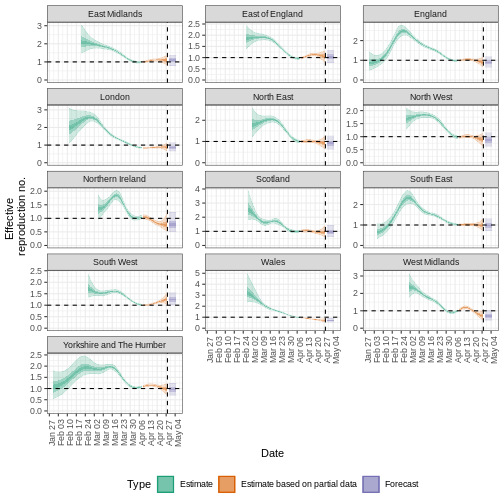

::: {.callout-note title="Perguntas"}

- Como posso estimar o número de reprodução variante no tempo ($R_t$) e a taxa de crescimento a partir de uma série temporal de dados de casos?
- Como posso quantificar a heterogeneidade geográfica a partir dessas métricas de transmissão?

:::

::: {.callout-tip title="Objetivos"}

- Aprender a estimar métricas de transmissão a partir de uma série temporal de dados de casos usando o pacote R `{EpiNow2}`

:::

::: {.callout-important title="Pré-requisitos"}

## Pré-requisitos

Você deve se familiarizar com os seguintes conceitos antes de trabalhar neste tutorial:

**Estatística**: [distribuições de probabilidade](https://epiverse-trace.github.io/tutorials/), princípios de análise bayesiana.

**Teoria epidêmica**: [Tempo de geração](01-acessar-atrasos.qmd), número de reprodução efetivo.

**Ciência de dados**: transformação e visualização de dados. Você pode revisar o episódio sobre [agregar e visualizar](https://epiverse-trace.github.io/tutorials-early/aggreagate-visualize.html) dados de incidência.

**Pacotes R instalados**: `{EpiNow2}`, `{incidence2}`, `{tidyverse}`.

:::

::: {.callout-note title="Detalhes" collapse="true"}

Instale os pacotes se eles ainda não estiverem instalados (se desejar, você pode configurar o espelho brasileiro do CRAN com `options(repos = c(CRAN = "https://cran-r.c3sl.ufpr.br/"))`):

```r
if (!base::require("pak")) install.packages("pak")
pak::pak(c("EpiNow2", "incidence2", "tidyverse"))
```

Se você receber alguma mensagem de erro,
acesse a [página principal de configuração](../setup.qmd#software-setup).

:::

::: {.callout-note}

### Lembrete: o número de reprodução efetivo, $R_t$

O [número de reprodução básico](../glossario.qmd#basic), $R_0$, é o número médio de casos causados por um indivíduo infeccioso em uma população totalmente suscetível.

Mas em um surto em andamento, a população não permanece totalmente suscetível, pois aqueles que se recuperam da infecção geralmente adquirem imunidade. Além disso, podem ocorrer mudanças no comportamento ou outros fatores que afetam a transmissão.

Quando temos interesse em monitorar as mudanças na transmissão, estamos mais interessados no valor do **número de reprodução efetivo**, $R_t$, que representa o número médio de casos causados por um indivíduo infeccioso na população no tempo $t$, dado o estado atual da população (incluindo níveis de imunidade e medidas de controle).

:::

## Introdução

A intensidade de transmissão de um surto é quantificada usando duas métricas fundamentais: o número de reprodução, que informa sobre a força da transmissão ao indicar quantos novos casos são esperados a partir de cada caso existente; e a [taxa de crescimento](../glossario.qmd#growth), que informa sobre a velocidade da transmissão ao indicar a rapidez com que o surto está se propagando ou diminuindo (tempo de duplicação/tempo de redução pela metade) em uma população. Para mais detalhes sobre a distinção entre velocidade e força de transmissão e suas implicações para o controle, consulte [Dushoff & Park, 2021](https://royalsocietypublishing.org/doi/full/10.1098/rspb.2020.1556).

Para estimar essas métricas fundamentais usando dados de casos, precisamos levar em conta os atrasos entre a data das infecções e a data dos casos notificados. Em uma situação de surto, os dados geralmente estão disponíveis apenas por datas de notificação; portanto, devemos usar métodos de estimação para corrigir para esses atrasos ao tentar entender as mudanças na transmissão ao longo do tempo.

Nos próximos tutoriais, nosso foco será em como usar as funções do `{EpiNow2}` para estimar métricas de transmissão a partir de dados de casos. Não abordaremos a fundamentação teórica dos modelos ou da estrutura de inferência; para detalhes sobre esses conceitos, consulte a [vinheta](https://epiforecasts.io/EpiNow2/dev/articles/estimate_infections.html).

Neste tutorial, aprenderemos a usar o pacote `{EpiNow2}` para estimar o número de reprodução variante no tempo. Obteremos os dados de entrada do `{incidence2}`. Usaremos os pacotes `{tidyr}` e `{dplyr}` para organizar algumas de suas saídas, o `{ggplot2}` para visualizar a distribuição dos casos e o operador pipe `%>%` para encadear algumas de suas funções; portanto, vamos carregar também o pacote `{tidyverse}`:

```r
library(EpiNow2)
library(incidence2)
library(tidyverse)
```

```{r,echo=FALSE,eval=TRUE,message=FALSE,warning=FALSE}
library(tidyverse)
```

::: {.callout-note title="Checklist"}

### Os dois-pontos duplos

Os dois-pontos duplos `::` no R permitem chamar uma função específica de um pacote sem carregar o pacote inteiro no ambiente atual.

Por exemplo, `dplyr::filter(data, condition)` usa `filter()` do pacote `{dplyr}`.

Isso nos ajuda a lembrar as funções dos pacotes e a evitar conflitos de namespace.

:::

::: {.callout-important title="Para o instrutor" collapse="true"}

Este tutorial ilustra o uso de `epinow()` para estimar o número de reprodução variante no tempo e os momentos de infecção. As pessoas participantes devem compreender as entradas necessárias para o modelo e as limitações das saídas geradas.

:::

::: {.callout-note}

### Inferência bayesiana

O pacote R `EpiNow2` usa uma estrutura de [inferência bayesiana](../glossario.qmd#bayesian) para estimar números de reprodução e momentos de infecção com base nas datas de notificação. Em outras palavras, ele estima a transmissão com base em quando as pessoas foram efetivamente infectadas (em vez do início dos sintomas), levando em conta os atrasos nos dados observados. Em contrapartida, o pacote `{EpiEstim}` permite uma estimação em tempo real mais rápida e simples do número de reprodução usando apenas dados de casos ao longo do tempo, refletindo como a transmissão varia com base em quando os sintomas aparecem.

Na inferência bayesiana, usamos o conhecimento a priori (distribuições a priori) com os dados (em uma função de verossimilhança) para encontrar a probabilidade a posteriori:

$Posterior \, probability \propto likelihood \times prior \, probability$

:::

::: {.callout-important title="Para o instrutor" collapse="true"}

Faça referência à distribuição de probabilidade a priori e à distribuição de [probabilidade a posteriori](https://en.wikipedia.org/wiki/Posterior_probability).

No [callout "`Expected change in reports`"](#expected-change-in-daily-cases), por "probabilidade a posteriori de que $R_t < 1$", referimo-nos especificamente à [área sob a curva da distribuição de probabilidade a posteriori](https://www.nature.com/articles/nmeth.3368/figures/1).

:::

## Distribuições de atraso e dados de casos
### Dados de casos

Para ilustrar as funções do `EpiNow2`, usaremos dados de surto do início da pandemia de COVID-19 no Reino Unido, considerando apenas os primeiros 90 dias observados. Os dados estão disponíveis no pacote R `{incidence2}`.

::: {.callout-note title="No Brasil: de onde vêm as séries de casos"}

As séries usadas neste tipo de análise saem dos sistemas de notificação: o **SINAN** para os
agravos de notificação compulsória e o **SIVEP-Gripe** para casos e óbitos por SRAG. O SIVEP-Gripe
é o sistema oficial de registro da SRAG no país e tem base pública em [Portal de Dados Abertos do SUS — SIVEP-Gripe](https://dadosabertos.saude.gov.br/dataset/srag-2019-a-2026).

Duas consequências práticas: os períodos mais recentes são **dados preliminares**, sujeitos a
revisão, e a consolidação leva tempo — é daí que vem a censura à direita nas últimas semanas da
série. Fonte sobre a diferença entre dados preliminares e finais: [SINAN — instrucional para download de microdados](http://portalsinan.saude.gov.br/images/documentos/Agravos/microdados/INSTRUCIONAL_PARA_DOWNLOAD_DE_MICRODADOS_DO_SINAN.pdf).

:::

```{r}
dplyr::as_tibble(incidence2::covidregionaldataUK)
```

Para usar os dados, precisamos formatá-los para ter duas colunas:

+ `date`: a data (como um objeto de data, veja `?is.Date()`),
+ `confirm`: número de notificações da doença (confirm) nessa data.

Vamos usar o `{tidyr}` e o `{incidence2}` para isso:

```{r, warning = FALSE, message = FALSE}
cases_incidence <- incidence2::covidregionaldataUK %>%
  tibble::as_tibble() %>%
  # Pré-processar valores ausentes
  tidyr::replace_na(base::list(cases_new = 0)) %>%
  # Calcular a incidência diária
  incidence2::incidence(
    date_index = "date",
    counts = "cases_new",
    count_values_to = "confirm",
    date_names_to = "date",
    complete_dates = TRUE
  )
```

Com `incidence2::incidence()`, agregamos casos em diferentes *intervalos* de tempo (isto é, dias, semanas ou meses) ou por categorias de *grupo*. Além disso, podemos obter datas completas para todo o intervalo de datas por categoria de grupo usando `complete_dates = TRUE`.
Explore mais tarde o [manual de referência de `incidence2::incidence()`](https://www.reconverse.org/incidence2/manual.html#sec:man-incidence).

::: {.callout-note title="Detalhes" collapse="true"}

**Podemos reproduzir o {incidence2} com o {dplyr}?**

Podemos obter um objeto semelhante a `cases` a partir do data frame `incidence2::covidregionaldataUK` usando o pacote `{dplyr}`.

```{r, warning = FALSE, message = FALSE, eval=FALSE}
incidence2::covidregionaldataUK %>%
  dplyr::select(date, cases_new) %>%
  dplyr::group_by(date) %>%
  dplyr::summarise(confirm = sum(cases_new, na.rm = TRUE)) %>%
  dplyr::ungroup()
```

No entanto, a função `incidence2::incidence()` contém argumentos convenientes, como `complete_dates`, que facilitam a obtenção de um objeto de incidência com o mesmo intervalo de datas para cada agrupamento, sem a necessidade de linhas de código extras ou de um pacote de séries temporais.

:::

Vamos contextualizar este episódio no cenário de um **surto em andamento** com apenas os **primeiros 90 dias** de dados observados (escolhidos aqui para fins de ilustração, não como uma etapa obrigatória).

```{r}
# Supor que temos apenas os primeiros 90 dias desses dados
cases_sliced <- cases_incidence %>%
  dplyr::slice_head(n = 90)

plot(cases_sliced)
```

Para passar as saídas do `{incidence2}` para o `{EpiNow2}`, precisamos remover uma coluna do objeto `cases_sliced`:

```{r}
# Remover coluna para atender ao formato de entrada do {EpiNow2}
cases <- cases_sliced %>%
  dplyr::select(-count_variable)

cases
```

### Distribuições de atraso

Assumimos que existem atrasos desde o momento da infecção até o momento em que um caso é notificado. Especificamos esses atrasos como distribuições para levar em conta a incerteza nas diferenças em nível individual. O atraso pode envolver múltiplos tipos de processos. Um atraso típico desde o momento da infecção até a notificação do caso pode consistir em:

> **tempo da infecção até o início dos sintomas** (o [período de incubação](../glossario.qmd#incubation)) + **tempo do início dos sintomas até a notificação do caso** (o tempo de notificação).

A distribuição de atraso para cada um desses processos pode ser estimada a partir de dados ou obtida da literatura. Podemos expressar a incerteza sobre os parâmetros corretos das distribuições assumindo que elas têm parâmetros **fixos** ou parâmetros **variáveis**. Para entender a diferença entre distribuições **fixas** e **variáveis**, vamos considerar o período de incubação.

::: {.callout-note}

### Atrasos e dados
O número e o tipo de atraso são entradas flexíveis que dependem dos dados. Os exemplos abaixo destacam como os atrasos podem ser especificados para diferentes fontes de dados:

<center>

| Fonte de dados | Atraso(s) |
| ------------- |-------------|
| Momento do início dos sintomas | Período de incubação |
| Momento da notificação do caso | Período de incubação + tempo do início dos sintomas até a notificação do caso |
| Momento da internação | Período de incubação + tempo do início dos sintomas até a internação |

</center>

:::

#### Distribuição do período de incubação

A distribuição do período de incubação para muitas doenças geralmente pode ser obtida da literatura. O pacote `{epiparameter}` contém uma biblioteca de parâmetros epidemiológicos para diferentes doenças extraídos da literatura.

Especificamos uma distribuição gama (fixa) com média $\mu = 4$ e desvio-padrão $\sigma = 2$ (shape = $4$, scale = $1$) usando a função `Gamma()`, da seguinte forma:

```{r}
incubation_period_fixed <- EpiNow2::Gamma(
  mean = 4,
  sd = 2,
  max = 20
)

incubation_period_fixed
```

Aqui você configura o período de incubação usando estatísticas resumo (`mean = 4`, `sd = 2`) como entrada, mas o `{EpiNow2}` converte esses valores nos parâmetros `shape` e `rate` de uma distribuição de probabilidade Gama e os imprime como saída. O argumento `max` é o valor máximo que a distribuição pode assumir; neste exemplo, 20 dias.

Podemos plotar as distribuições geradas pelo `{EpiNow2}` usando `plot()`:

```{r}
plot(incubation_period_fixed)
```

::: {.callout-note}

### Por que uma distribuição gama?

O período de incubação deve ser um valor positivo. Portanto, devemos especificar uma distribuição no `{EpiNow2}` restrita apenas a valores positivos.

`Gamma()` dá suporte a distribuições Gama e `LogNormal()` a distribuições Log-normal, que são distribuições exclusivas para valores positivos.

Para todos os tipos de atraso, precisaremos usar distribuições restritas a valores positivos — não queremos incluir atrasos com dias negativos em nossa análise!

:::

#### Incluindo a incerteza da distribuição

Para especificar uma distribuição **variável**, incluímos incerteza em torno da média $\mu$ e do desvio-padrão $\sigma$ de nossa distribuição gama. Se a nossa distribuição do período de incubação tem média $\mu$ e desvio-padrão $\sigma$, podemos assumir que a média ($\mu$) segue uma distribuição Normal com desvio-padrão $\sigma_{\mu}$:

$$\mbox{Normal}(\mu,\sigma_{\mu}^2)$$

e o desvio-padrão ($\sigma$) segue uma distribuição Normal com desvio-padrão $\sigma_{\sigma}$:

$$\mbox{Normal}(\sigma,\sigma_{\sigma}^2).$$

Especificamos isso usando `Normal()` para cada argumento: a média ($\mu = 4$ com $\sigma_{\mu} = 0.5$) e o desvio-padrão ($\sigma = 2$ com $\sigma_{\sigma} = 0.5$).

```{r,warning=FALSE,message=FALSE}
incubation_period_variable <- EpiNow2::Gamma(
  mean = EpiNow2::Normal(mean = 4, sd = 0.5),
  sd = EpiNow2::Normal(mean = 2, sd = 0.5),
  max = 20
)

incubation_period_variable
```

Vamos plotar a distribuição que acabamos de configurar:

```{r}
plot(incubation_period_variable)
```

::: {.callout-note title="Checklist"}

Preferimos adicionar incerteza a cada estimativa pontual sempre que disponível. As boas práticas no relato de distribuições de atraso epidemiológicas recomendam incluir estimativas de incerteza, pois isso pode impactar a modelagem subsequente e sinalizar que mais dados são necessários ([Charniga et al., 2024](https://doi.org/10.1371/journal.pcbi.1012520)).

:::

#### Atrasos de notificação

Após o período de incubação, haverá um atraso de tempo adicional entre o início dos sintomas e a notificação do caso: o atraso de notificação. Podemos especificar isso como uma distribuição fixa ou variável, ou estimar uma distribuição a partir dos dados.

Ao especificar uma distribuição, é útil visualizar a densidade de probabilidade para observar o pico e a dispersão da distribuição; neste caso, usaremos uma distribuição *log-normal*.

Se quisermos assumir que o atraso médio de notificação é de 2 dias (com uma incerteza de 0,5 dia) e um desvio-padrão de 1 dia (com incerteza de 0,5 dia), podemos especificar uma distribuição variável usando `LogNormal()` como fizemos antes:

```{r,warning=FALSE,message=FALSE}
reporting_delay_variable <- EpiNow2::LogNormal(
  mean = EpiNow2::Normal(mean = 2, sd = 0.5),
  sd = EpiNow2::Normal(mean = 1, sd = 0.5),
  max = 10
)
```

::: {.callout-note title="Detalhes" collapse="true"}

**Como obter o atraso de notificação a partir dos dados?**

Se houver dados disponíveis sobre o tempo entre o início dos sintomas e a notificação, podemos usar a função `EpiNow2::estimate_delay()` para estimar uma distribuição log-normal a partir de um vetor de atrasos.

O código abaixo ilustra como usar `EpiNow2::estimate_delay()` com dados sintéticos de ebola. Calculamos o atraso de notificação para cada caso como a diferença de tempo **da** data de início dos sintomas **até** a data de internação (data em que o caso foi notificado).

```{r, eval = TRUE, message = FALSE, warning = FALSE}
library(tidyverse)

# Etapas:
# - obter dados de ebola do pacote {outbreaks}
# - manter um subconjunto de colunas apenas para este exemplo
# - calcular a diferença de tempo entre duas datas na linelist
# - extrair a diferença de tempo como um objeto da classe vector
# - estimar os parâmetros de atraso usando {EpiNow2}

outbreaks::ebola_sim_clean$linelist %>%
  tibble::as_tibble() %>%
  dplyr::select(case_id, date_of_onset, date_of_hospitalisation) %>%
  dplyr::mutate(reporting_delay = date_of_hospitalisation - date_of_onset) %>%
  dplyr::pull(reporting_delay) %>%
  EpiNow2::estimate_delay(
    samples = 1000,
    bootstraps = 10
  )
```

:::

#### Tempo de geração

Como apresentamos no [episódio anterior deste tutorial](01-acessar-atrasos.qmd), também precisamos especificar uma distribuição para o tempo de geração. Aqui usaremos uma distribuição log-normal com média de 3,6 e desvio-padrão de 3,1 ([Ganyani et al. 2020](https://doi.org/10.2807/1560-7917.ES.2020.25.17.2000257)).

```{r,warning=FALSE,message=FALSE}
generation_time_variable <- EpiNow2::LogNormal(
  mean = EpiNow2::Normal(mean = 3.6, sd = 0.5),
  sd = EpiNow2::Normal(mean = 3.1, sd = 0.5),
  max = 20
)
```

::: {.callout-note title="Checklist"}

Agora temos as distribuições necessárias para quantificar a transmissão a partir de notificações de casos usando o `{EpiNow2}`:

- **Tempo de geração**: tempo entre o início da infecciosidade em um caso primário (índice) e em seu caso secundário.
- **Atrasos**: tempo da infecção até a notificação do caso (período de incubação + atraso de notificação).

```r
generation_time_variable
incubation_period_variable
reporting_delay_variable
```

:::

::: {.callout-note title="Para se aprofundar"}

Observe que podemos configurar estatísticas resumo (por exemplo, `mean`, `sd`) como entrada para `EpiNow2::LogNormal()` ou `EpiNow2::Gamma()`, mas o `{EpiNow2}` sempre as converterá para parâmetros da distribuição de probabilidade: `shape` e `scale` para Gamma, `meanlog` e `sdlog` para LogNormal.

Quando possível, preferimos especificar diretamente os parâmetros "naturais" da distribuição (como `shape` e `rate` para Gamma, `meanlog` e `sdlog` para LogNormal), em vez de depender da conversão média/desvio-padrão, pois isso evita ambiguidades e proporciona um controle mais preciso sobre a distribuição resultante.

:::

::: {.callout-tip .desafio title="Desafio"}

Usando o período de incubação do sarampo do pacote `{epiparameter}`, adapte essa saída à interface de distribuição do `{EpiNow2}`.

```{r, message = FALSE, warning = FALSE}
measles_incubation <- epiparameter::epiparameter_db(
  disease = "Measles",
  epi_name = "incubation",
  single_epiparameter = TRUE
)
```

::: {.callout-note title="Dica" collapse="true"}

Use estas perguntas como guia:

- O tempo de incubação segue uma distribuição LogNormal ou Gamma?
- Quais são os *parâmetros da distribuição* do tempo de incubação?
- Com base nessa distribuição, qual função devemos usar: `EpiNow2::LogNormal()` ou `EpiNow2::Gamma()`?
- Qual poderia ser o número máximo de dias para essa distribuição? Observe isso a partir de um gráfico.

Você pode copiar e colar os valores dos parâmetros correspondentes diretamente da saída do `{epiparameter}` na entrada do `{EpiNow2}`.

:::

::: {.callout-note .solucao title="Solução" collapse="true"}

Vamos imprimir a saída:

```{r}
measles_incubation
```

Ela segue uma distribuição Log-normal (`lnorm`), com os parâmetros: `meanlog` e `sdlog`; portanto, a função correspondente é `EpiNow2::LogNormal()`.

```{r}
plot(measles_incubation, xlim = c(0, 25))
```

A partir do gráfico, um valor máximo plausível para o período de incubação seria de 20 dias.

Em seguida, nossa chamada da função do EpiNow2 fica assim:

```{r}
measles_incubation_epinow <- EpiNow2::LogNormal(
  meanlog = 2.526,
  sdlog = 0.207,
  max = 20
)

measles_incubation_epinow
```

Ou `epiparameter::get_parameters(measles_incubation)` para reutilizar os parâmetros diretamente.

O gráfico gerado pelo {EpiNow2} é:

```{r}
plot(measles_incubation_epinow)
```

Observe que se esquecermos de definir um valor máximo, obteremos um erro nesta etapa.

:::

:::

## Obtenção das estimativas

A função `epinow()` é um wrapper para a função `estimate_infections()`, usada para estimar casos por data de infecção. A distribuição do tempo de geração e as distribuições de atraso devem ser fornecidas usando as funções `generation_time_opts()` e `delay_opts()`, respectivamente.

Existem muitas outras entradas que podem ser passadas para `epinow()`; consulte `?EpiNow2::epinow()` para mais detalhes.
Uma entrada opcional é especificar uma priori *log-normal* para o número de reprodução efetivo $R_t$ no início do surto. Especificamos uma média de 2 e desvio-padrão de 2 como argumentos de `prior` dentro de `rt_opts()`:

```{r, eval = TRUE}
# definir a distribuição a priori de Rt
rt_prior <- EpiNow2::rt_opts(prior = EpiNow2::LogNormal(mean = 2, sd = 2))
```

::: {.callout-note}

### Inferência bayesiana usando o Stan

A inferência bayesiana é realizada usando métodos MCMC com o programa [Stan](https://mc-stan.org/). Há uma série de configurações padrão para as funções do Stan, incluindo o número de cadeias e o número de amostras por cadeia (veja `?EpiNow2::stan_opts()`).

Para reduzir o tempo de computação, podemos executar as cadeias em paralelo. Para fazer isso, devemos definir o número de núcleos a serem utilizados. Por padrão, 4 cadeias MCMC são executadas (veja `EpiNow2::stan_opts()$chains`), de modo que podemos definir um número igual de núcleos para serem usados em paralelo da seguinte forma:

```{r,warning=FALSE,message=FALSE}
withr::local_options(base::list(mc.cores = 4))
```

Para descobrir o número máximo de núcleos disponíveis na sua máquina, use `parallel::detectCores()`.
Se tiver menos de 4, você pode substituir `mc.cores = 4` por `mc.cores = parallel::detectCores() - 1`.

:::

::: {.callout-note title="Checklist"}

**Nota:** no código abaixo, são usadas as distribuições `*_fixed` em vez de `*_variable` (distribuições de atraso com incerteza). Isso serve para acelerar o tempo de computação. De modo geral, recomenda-se usar distribuições variáveis que levem em conta a incerteza adicional.

```{r, echo = TRUE}
# alternativas fixas
generation_time_fixed <- EpiNow2::LogNormal(
  mean = 3.6,
  sd = 3.1,
  max = 20
)

reporting_delay_fixed <- EpiNow2::LogNormal(
  mean = 2,
  sd = 1,
  max = 10
)
```

:::

Agora você está pronto para executar `EpiNow2::epinow()` para estimar o número de reprodução variante no tempo para os primeiros 90 dias:

```{r, message = FALSE, eval = TRUE, echo=TRUE}
estimates <- EpiNow2::epinow(
  # casos notificados
  data = cases,
  # atrasos
  generation_time = EpiNow2::generation_time_opts(generation_time_fixed),
  delays = EpiNow2::delay_opts(incubation_period_fixed + reporting_delay_fixed),
  # priori
  rt = rt_prior
)
```

<!-- ```{r, message = FALSE,warning=FALSE, eval = TRUE, echo=FALSE} -->
<!-- estimates <- EpiNow2::epinow( -->
<!--   # reported cases -->
<!--   data = cases, -->
<!--   # delays -->
<!--   generation_time = EpiNow2::generation_time_opts(generation_time_fixed), -->
<!--   delays = EpiNow2::delay_opts(incubation_period_fixed + reporting_delay_fixed), -->
<!--   # prior -->
<!--   rt = rt_prior, -->
<!--   stan = EpiNow2::stan_opts(method = "vb") -->
<!-- ) -->
<!-- ``` -->

::: {.callout-note}

### Não espere a conclusão disto para continuar

Para o propósito deste tutorial, podemos opcionalmente usar `EpiNow2::stan_opts()` para reduzir o tempo de computação. Podemos especificar um número fixo de `samples = 1000` e `chains = 2` no argumento `stan` da função `EpiNow2::epinow()`. Esperamos que isso leve aproximadamente 3 minutos.

<!-- We can optionally set `stan = stan_opts(method = "vb")` to use an approximate sampling method. We expect this to take less than 1 minute. -->

```r
# você pode adicionar o argumento `stan`
EpiNow2::epinow(
  ...,
  stan = EpiNow2::stan_opts(samples = 1000, chains = 2)
)
```

**Lembre-se:** usar um número adequado de *samples* (amostras) e *chains* (cadeias) é crucial para garantir a convergência e obter estimativas confiáveis em computações bayesianas usando o Stan. Saídas mais precisas têm como contrapartida um tempo de processamento maior.

:::

### Resultados

Podemos extrair e visualizar as estimativas do número de reprodução efetivo ao longo do tempo:

```{r}
plot(estimates, type = "R")
```

A incerteza nas estimativas aumenta ao longo do tempo. Isso ocorre porque as estimativas são orientadas por dados do passado — dentro dos períodos de atraso.

O gráfico distingue três categorias:

- **Estimate** (verde) usa todos os dados disponíveis;
- **Estimate based on partial data** (laranja) baseia-se em menos dados (porque as infecções em torno desse período têm maior probabilidade de ainda não terem sido observadas) e, portanto, apresenta intervalos progressivamente mais amplos em direção à data do último ponto de dados; e
- **Forecast** (roxo) é uma projeção para o futuro.

Também podemos visualizar a estimativa da taxa de crescimento ao longo do tempo:
```{r}
plot(estimates, type = "growth_rate")
```

Para extrair um resumo das principais métricas de transmissão na *data mais recente* dos dados:

```{r}
summary(estimates)
```

Como essas estimativas são baseadas em dados parciais, elas têm um amplo intervalo de incerteza.

+ A partir do resumo de nossa análise, vemos que a mudança esperada nas notificações é `r summary(estimates)$estimate[summary(estimates)$measure=="Expected change in reports"]` com novas infecções estimadas em `r summary(estimates)$estimate[summary(estimates)$measure=="New infections per day"]`.

+ A estimativa do número de reprodução efetivo $R_t$ (na última data dos dados) é `r summary(estimates)$estimate[summary(estimates)$measure=="Effective reproduction no."]`.

+ A taxa de crescimento exponencial do número de casos é `r summary(estimates)$estimate[summary(estimates)$measure=="Rate of growth"]`.

+ O tempo de duplicação (o tempo necessário para o número de casos dobrar) é `r summary(estimates)$estimate[summary(estimates)$measure=="Doubling/halving time (days)"]`.

::: {.callout-note}

### `Expected change in reports`

Um fator que descreve a mudança esperada nas notificações com base na probabilidade a posteriori de que $R_t < 1$.

<center>
| Probabilidade ($p$) | Mudança esperada |
| ------------- |-------------|
|$p < 0.05$ | Aumentando (*Increasing*) |
|$0.05 \leq p< 0.4$ | Provavelmente aumentando (*Likely increasing*) |
|$0.4 \leq p< 0.6$ | Estável (*Stable*) |
|$0.6 \leq p < 0.95$ | Provavelmente diminuindo (*Likely decreasing*) |
|$0.95 \leq p \leq 1$ | Diminuindo (*Decreasing*) |
</center>

:::

::: {.callout-note}

### Intervalos de credibilidade

Em todas as figuras de saída do `{EpiNow2}`, as regiões sombreadas refletem intervalos de credibilidade de 90%, 50% e 20%, ordenados do mais claro ao mais escuro.

:::

::: {.callout-tip .desafio title="Desafio"}

Na saída de `plot(estimates, type = "R")`, qual parâmetro de entrada delimita a extensão da trajetória com a categoria `Estimate based on parial data` (laranja)?

::: {.callout-note title="Dica" collapse="true"}

Como explicamos acima, as infecções em torno desse período têm maior probabilidade de ainda não terem sido observadas. Portanto, o parâmetro de entrada deve informar a probabilidade de observar novas infecções.

:::

::: {.callout-note .solucao title="Solução" collapse="true"}

O valor máximo finito da distribuição do *tempo de geração* define o intervalo de `Estimate based on parial data`.
O *tempo de geração* foi configurado com um valor máximo de 20 dias.

:::

:::

::: {.callout-note title="Checklist"}

O `{EpiNow2}` pode ser usado para estimar métricas de transmissão a partir de dados de casos em qualquer momento durante o curso de um surto. A confiabilidade dessas estimativas depende da qualidade dos dados e da escolha apropriada das distribuições de atraso.

Para reutilizar diretamente os atrasos armazenados no `{epiparameter}`, leia o próximo tutorial sobre [usar distribuições de atraso na análise](03-funcoes-de-atraso.qmd).

Para aprender a criar previsões e explorar algumas das opções adicionais de inferência disponíveis no `{EpiNow2}`, leia o tutorial seguinte sobre [criar previsões de curto prazo](04-criar-previsoes.qmd).

:::

::: {.callout-note title="Discussão"}

### Como o {EpiNow2} funciona?

O {EpiNow2} contém diferentes modelos sobre como as infecções surgem.
Um dos principais modelos usados na configuração padrão é o **modelo da equação de renovação**.
Se você quiser se familiarizar com ele e aprender como os atrasos são levados em conta na estimativa de $R_t$,
você pode ler o episódio sobre
[Introdução à equação de renovação](../notas/equacao-de-renovacao.qmd)
na seção "Mais recursos" do site deste tutorial.

:::

## Desafio

::: {.callout-tip .desafio title="Desafio"}

**Quantificar a heterogeneidade geográfica**

Os dados de surto do início da pandemia de COVID-19 no Reino Unido provenientes do pacote R `{incidence2}` incluem a região em que os casos foram registrados. Para encontrar estimativas regionais do número de reprodução efetivo e de casos, devemos formatar os dados para que tenham três colunas:

+ `date`: a data,
+ `region`: a região,
+ `confirm`: número de notificações da doença (confirm) para uma região em uma determinada data.

Gere estimativas regionais de Rt a partir do data frame `incidence2::covidregionaldataUK`:

- use o `{incidence2}` para converter os dados agregados em dados de incidência pela variável `region`,
- mantenha as primeiras 90 datas para todas as regiões,
- estime o Rt por região usando o tempo de geração e os atrasos definidos neste episódio.

```{r}
regional_cases <- incidence2::covidregionaldataUK %>%
  # usar o {tidyr} para pré-processar valores ausentes
  tidyr::replace_na(base::list(cases_new = 0))
```

::: {.callout-note title="Dica" collapse="true"}

Para manipular os dados, você pode:

```{r}
regional_cases <- incidence2::covidregionaldataUK %>%
  # usar o {tidyr} para pré-processar valores ausentes
  tidyr::replace_na(base::list(cases_new = 0)) %>%
  # usar o {incidence2} para converter dados agregados em dados de incidência
  incidence2::incidence(
    date_index = "date",
    groups = "region",
    counts = "cases_new",
    count_values_to = "confirm",
    date_names_to = "date",
    complete_dates = TRUE
  ) %>%
  dplyr::select(-count_variable) %>%
  dplyr::filter(date < ymd(20200301))
```

Para aprender como realizar a estimação regional de Rt, leia a seção sobre `regional_epinow()` na vinheta Get started em <https://epiforecasts.io/EpiNow2/articles/EpiNow2.html#regional_epinow>

:::

::: {.callout-note .solucao title="Solução" collapse="true"}

Para encontrar estimativas regionais, usamos as mesmas entradas de `epinow()` na função `regional_epinow()`:

```{r, message = FALSE, eval = FALSE}
estimates_regional <- EpiNow2::regional_epinow(
  # casos
  data = regional_cases,
  # atrasos
  generation_time = EpiNow2::generation_time_opts(generation_time_fixed),
  delays = EpiNow2::delay_opts(incubation_period_fixed + reporting_delay_fixed),
  # priori
  rt = rt_prior
)
```

Plote os resultados com:

```{r, message = FALSE, eval = FALSE}
estimates_regional$summary$summarised_results$table

estimates_regional$summary$plots$R
```



:::

:::

<!-- :::::::::::::::::::::::::: testimonial -->

<!-- ### the i2extras package -->

<!-- `{i2extras}` package also estimate transmission metrics like growth rate and doubling/halving time at different time intervals (i.e., days, weeks, or months). `{i2extras}` require `{incidence2}` objects as inputs. Read further in its [Fitting curves](https://www.reconverse.org/i2extras/articles/fitting_epicurves.html) vignette. -->

<!-- :::::::::::::::::::::::::: -->

::: {.callout-note title="Pontos-chave"}

- Métricas de transmissão podem ser estimadas a partir de dados de casos após levar em conta os atrasos
- A incerteza pode ser incorporada nas distribuições de atraso

:::
