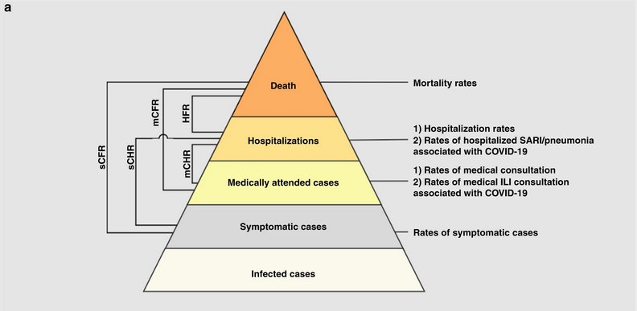
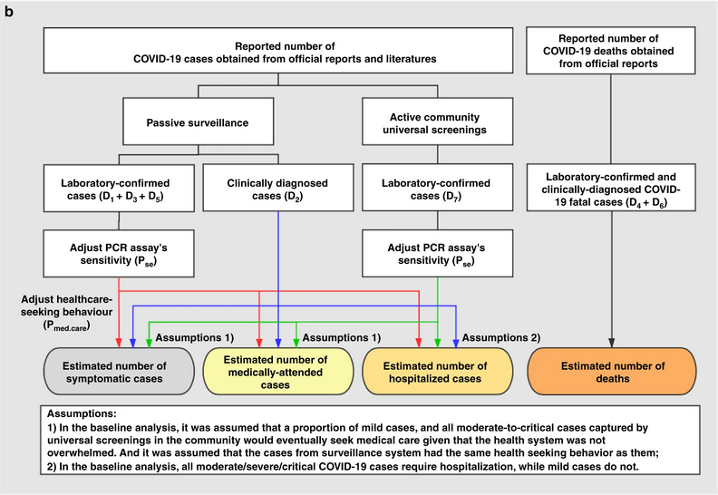

::: {.callout-note title="Perguntas"}

- Por que estimamos a gravidade clínica de uma epidemia?

- Como o risco de letalidade (CFR) pode ser estimado no início de uma epidemia em curso?

:::

::: {.callout-tip title="Objetivos"}

- Estimar o CFR a partir de dados agregados de casos usando `{cfr}`.

- Estimar um CFR ajustado pelo atraso usando `{epiparameter}` e `{cfr}`.

- Estimar uma gravidade ajustada pelo atraso para uma série temporal em expansão usando `{cfr}`.

:::

::: {.callout-important title="Pré-requisitos"}

## Pré-requisitos

Este episódio requer que você esteja familiarizado com:

**Ciência de dados**: Programação básica com R.

**Teoria epidêmica**: [Distribuições de atraso](../glossario.qmd#delaydist).

**Pacotes de R instalados**: `{cfr}`, `{epiparameter}`, `{outbreaks}`, `{tidyverse}`.

:::

::: {.callout-note title="Detalhes" collapse="true"}

Instale os pacotes caso ainda não estejam instalados

```r
if (!base::require("pak")) install.packages("pak")
pak::pak(c("cfr", "epiparameter", "tidyverse", "outbreaks"))
```

Se você encontrar alguma mensagem de erro,
acesse a [página principal de configuração](../setup.qmd#software-setup).

:::

## Introdução

Perguntas comuns na fase inicial de uma epidemia incluem:

- Qual é o provável impacto do surto na saúde pública em termos de gravidade clínica?
- Quais são os grupos mais gravemente afetados?
- O surto tem potencial para causar uma pandemia muito grave?

Podemos avaliar o potencial pandêmico de uma epidemia com duas medidas críticas: a transmissibilidade e a gravidade clínica
([Fraser et al., 2009](https://www.science.org/doi/full/10.1126/science.1176062), 
[CDC, 2024](https://www.cdc.gov/pandemic-flu/php/national-strategy/severity-assessment-framework.html)).

).](../img/cfr-hhs-scenarios-psaf.png){alt='O eixo horizontal é a medida em escala da gravidade clínica, variando de 1 a 7, onde 1 é baixo, 4 é moderado e 7 é muito grave. O eixo vertical é a medida em escala da transmissibilidade, variando de 1 a 5, onde 1 é baixo, 3 é moderado e 5 é altamente transmissível. No gráfico, os cenários de planejamento pandêmico do HHS estão rotulados em quatro quadrantes (A, B, C e D). Da esquerda para a direita, os cenários são “faixa sazonal”, “pandemia moderada”, “pandemia grave” e “pandemia muito grave”. À medida que a gravidade clínica aumenta ao longo do eixo horizontal, ou que a transmissibilidade aumenta ao longo do eixo vertical, a gravidade do cenário de planejamento pandêmico também aumenta.'}

Uma abordagem epidemiológica para estimar a gravidade clínica é quantificar o risco de letalidade (CFR). O CFR é a probabilidade condicional de óbito dado o diagnóstico confirmado, calculada como a razão entre o número cumulativo de óbitos por uma doença infecciosa e o número de casos confirmados diagnosticados. No entanto, calcular isso diretamente durante o curso de uma epidemia tende a resultar em um CFR ingênuo ou viesado, devido ao [atraso](../glossario.qmd#delaydist) de tempo entre o início dos sintomas e o óbito, variando substancialmente à medida que a epidemia progride e estabilizando-se nos estágios finais do surto ([Ghani et al., 2005](https://academic.oup.com/aje/article/162/5/479/82647?login=false#620743)).

![Estimativas observadas e viesadas do risco de letalidade de casos confirmados (CFR) em função do tempo (linha espessa) calculadas como o número cumulativo de óbitos sobre os casos confirmados no tempo t. A estimativa ao final de um surto (~30 de maio) é o CFR realizado até o final da epidemia. A linha contínua horizontal e as linhas pontilhadas mostram o valor esperado e os intervalos de confiança de 95% ($95\%$ CI) da estimativa predita do CFR ajustado pelo atraso usando apenas os dados observados até 27 de março de 2003 ([Nishiura et al., 2009](https://journals.plos.org/plosone/article?id=10.1371/journal.pone.0006852))](../img/cfr-pone.0006852.g003-fig_c.png){alt='Os períodos são relevantes: Período 1 -- 15 dias em que o CFR é zero para indicar que isso se deve à ausência de óbitos notificados; Período de 15 de março a 26 de abril em que o CFR parece estar aumentando; Período de 30 de abril a 30 de maio em que a estimativa do CFR se estabiliza.'}

::: {.callout-important title="Para o instrutor" collapse="true"}

Os períodos são relevantes: Período 1 -- 15 dias em que o CFR é zero para indicar que isso se deve à ausência de óbitos notificados; Período de 15 de março a 26 de abril em que o CFR parece estar aumentando; Período de 30 de abril a 30 de maio em que a estimativa do CFR se estabiliza.

:::

De modo mais geral, estimar a gravidade pode ser útil mesmo fora de um cenário de planejamento pandêmico e no contexto da rotina de saúde pública. 
Saber se um surto tem ou teve uma gravidade diferente do registro histórico pode motivar investigações causais, 
que poderiam ser intrínsecas ao agente infeccioso (por exemplo, uma nova cepa mais grave) ou devidas a fatores subjacentes na população (por exemplo, imunidade reduzida ou fatores de morbidade) ([Lipsitch et al., 2015](https://journals.plos.org/plosntds/article?id=10.1371/journal.pntd.0003846)).

Neste tutorial, aprenderemos a usar o pacote `{cfr}` para calcular e ajustar uma estimativa de CFR usando [distribuições de atraso](../glossario.qmd#delaydist) do `{epiparameter}` ou de outras fontes, com base nos métodos desenvolvidos por [Nishiura et al., 2009](https://journals.plos.org/plosone/article?id=10.1371/journal.pone.0006852). Também exploraremos como podemos reutilizar funções do `{cfr}` para outras medidas de gravidade.

Usaremos o operador pipe `%>%` do pacote `{magrittr}` para encadear funções do `{cfr}`, incluindo outras do pacote `{dplyr}`. Portanto, carregaremos o pacote `{tidyverse}`, que contém tanto o `{magrittr}` quanto o `{dplyr}`.

```{r message=FALSE, warning=FALSE}
# carregar pacotes
library(cfr)
library(epiparameter)
library(tidyverse)
library(outbreaks)
```

::: {.callout-note title="Checklist"}

### Os dois-pontos duplos

Os dois-pontos duplos `::` no R permitem chamar uma função específica de um pacote sem carregar o pacote inteiro no ambiente atual. 

Por exemplo, `dplyr::filter(data, condition)` usa a função `filter()` do pacote `{dplyr}`.

Isso nos ajuda a lembrar as funções dos pacotes e a evitar conflitos de namespace.

:::

::: {.callout-note title="Discussão"}

Você já fez parte de uma equipe de resposta a epidemias? Se sim:

- Como você avaliou a gravidade clínica do surto?
- Quais foram as principais fontes de viés?
- O que você fez para levar em conta o viés identificado?
- Que análise complementar você faria para resolver o viés?

:::

## Fontes de dados para gravidade clínica

Que fontes de dados podemos usar para estimar a gravidade clínica de um surto de doença? [Verity et al., 2020](https://www.thelancet.com/journals/laninf/article/PIIS1473-3099(20)30243-7/fulltext) resumem o espectro de casos de COVID-19:

30243-7/fulltext#gr1))](../img/cfr-spectrum-cases-covid19.jpg)

- No topo da pirâmide, aqueles que atenderam aos critérios de definição de caso da OMS para casos **graves** ou **críticos** provavelmente teriam sido identificados no ambiente hospitalar, apresentando pneumonia viral atípica. Esses casos teriam sido identificados na China continental e entre aqueles classificados internacionalmente como transmissão local. 
- Muito mais casos provavelmente serão **sintomáticos** (ou seja, com febre, tosse ou mialgia), mas podem não necessitar de internação. Esses casos teriam sido identificados por meio de vínculos com viagens internacionais para áreas de alto risco e pelo rastreamento de contatos de casos confirmados. Eles poderiam ser identificáveis por meio da vigilância populacional de, por exemplo, síndrome gripal. 
- A parte inferior da pirâmide representa casos **leves** (e possivelmente **assintomáticos**). Esses casos poderiam ser identificáveis pelo rastreamento de contatos e, posteriormente, por meio de testes sorológicos.

## CFR ingênuo

Medimos a gravidade da doença em termos de risco de letalidade (CFR). O CFR é interpretado como a probabilidade condicional de óbito dado o diagnóstico confirmado, calculada como a razão entre o número cumulativo de óbitos $D_{t}$ e o número cumulativo de casos confirmados $C_{t}$ em um determinado tempo $t$. Podemos nos referir a ele como _CFR ingênuo_ (também CFR bruto ou viesado, $b_{t}$):

$$ naive \, CFR = b_{t} =  \frac{D_{t}}{C_{t}} $$

Esse cálculo é _ingênuo_ porque tende a produzir um CFR viesado e predominantemente subestimado devido ao atraso de tempo entre o início dos sintomas e o óbito, estabilizando-se apenas nos estágios mais avançados do surto.

Para calcular o CFR ingênuo, o pacote `{cfr}` requer um data frame de entrada com três colunas chamadas:

- `date`
- `cases`
- `deaths`

Vamos explorar o conjunto de dados `ebola1976`, incluído no {cfr}, que provém do primeiro surto de Ebola no Zaire (atual República Democrática do Congo) em 1976, conforme analisado por Camacho et al. (2014).

```{r}
# Carregar os dados de Ebola de 1976 fornecidos com o pacote {cfr}
data("ebola1976")

# Plotar a incidência de casos e notificações de óbitos
ebola1976 %>%
  incidence2::incidence(
    date_index = "date",
    counts = c("cases", "deaths")
  ) %>%
  plot()
```

Enquadraremos este episódio no contexto de um **surto em curso** com apenas os **primeiros 30 dias** de dados observados (escolhidos aqui para fins ilustrativos, não sendo uma etapa obrigatória).

```{r}
# Supor que temos apenas os primeiros 30 dias destes dados
ebola_30days <- ebola1976 %>%
  dplyr::slice_head(n = 30) %>%
  dplyr::as_tibble()

ebola_30days
```

Em uma análise em tempo real, use sempre os dados mais recentes disponíveis no momento.

::: {.callout-note}

### Precisamos de dados agregados de incidência

O `{cfr}` lê dados de incidência **agregados**. 

<!-- Similar ao `{EpiNow2}`, com a diferença de que para o `{cfr}` precisamos de mais uma coluna chamada `deaths`. -->

```{r,eval=FALSE,echo=FALSE}
EpiNow2::example_confirmed %>%
  dplyr::as_tibble()
```

Esses dados de entrada devem ser **agregados** por dia, o que significa uma observação *por dia*, contendo o número *diário* de casos e óbitos notificados. Observações com valores iguais a zero ou ausentes também devem ser incluídas, como em todos os dados de séries temporais.

Além disso, o `{cfr}` atualmente funciona apenas para dados *diários*, mas não para outras unidades temporais de agregação de dados, por exemplo, semanas.

<!-- sugerir formas de lidar com dados de incidência semanal -->
<!-- https://github.com/epiverse-trace/cfr/issues/117 -->

:::

::: {.callout-note title="Checklist"}

Ao agregar casos por dia com o `{incidence2}`, você pode adaptar os dados para o `{cfr}` usando `cfr::prepare_data()` em objetos `<incidence2>`. Para detalhes e um exemplo, consulte o manual de referência do `{cfr}` sobre [preparação de formatos comuns de dados epidemiológicos para estimativa de CFR](https://epiverse-trace.github.io/cfr/reference/prepare_data.html).

:::

Quando aplicamos `cfr_static()` diretamente a `data`, estamos calculando o CFR ingênuo:

```{r}
# Calcular o CFR ingênuo para os primeiros 30 dias
cfr::cfr_static(data = ebola_30days)
```

```{r,echo=FALSE}
out_naive <- cfr::cfr_static(data = ebola_30days)

outn_estimate <- out_naive %>% pull(severity_estimate)
outn_low <- out_naive %>% pull(severity_low)
outn_high <- out_naive %>% pull(severity_high)
```

O CFR ingênuo estima a gravidade geral da doença, considerando os _dados mais recentes disponíveis no momento_, como `r outn_estimate` com um intervalo de confiança de 95% entre `r outn_low` e `r outn_high`.

::: {.callout-tip .desafio title="Desafio"}

Baixe o arquivo [sarscov2_cases_deaths.csv](../data/sarscov2_cases_deaths.csv) e leia-o no R. 

Estime o CFR ingênuo.

::: {.callout-note title="Dica" collapse="true"}

Inspecione o formato dos dados de entrada.

- Contém dados diários?
- Os nomes das colunas coincidem com os exigidos por `cfr_static()`?
- Como você renomearia as colunas em um data frame?

:::

::: {.callout-note .solucao title="Solução" collapse="true"}

Lemos os dados de entrada usando `readr::read_csv()`. Esta função reconhece que a coluna `date` é um vetor de classe `<date>`.

```{r, eval=TRUE,echo=FALSE,warning=FALSE,message=FALSE}
# ler dados do projeto R do repositório do tutorial
sarscov2_input <-
  readr::read_csv(file.path("data", "sarscov2_cases_deaths.csv"))
```

```{r,eval=FALSE,echo=TRUE,warning=FALSE,message=FALSE}
# ler dados
# ex.: se o caminho para o arquivo for data/raw-data/ebola_cases.csv, então:
sarscov2_input <-
  readr::read_csv(here::here("data", "raw-data", "sarscov2_cases_deaths.csv"))
```

```{r}
# Inspecionar os dados
sarscov2_input
```

Podemos usar `dplyr::rename()` para adaptar os dados externos ao formato de entrada para `cfr::cfr_static()`.

```{r}
# Renomear colunas antes de estimar o CFR ingênuo
sarscov2_input %>%
  dplyr::rename(
    cases = cases_jpn,
    deaths = deaths_jpn
  ) %>%
  cfr::cfr_static()
```

```{r,echo=FALSE}
out_challenge <- sarscov2_input %>%
  dplyr::rename(
    cases = cases_jpn,
    deaths = deaths_jpn
  ) %>%
  cfr::cfr_static()

outc_estimate <- out_challenge %>% pull(severity_estimate)
outc_low <- out_challenge %>% pull(severity_low)
outc_high <- out_challenge %>% pull(severity_high)
```

O CFR ingênuo estima a gravidade geral da doença, considerando os _dados mais recentes disponíveis no momento_, como `r outc_estimate` com um intervalo de confiança de 95% entre `r outc_low` e `r outc_high`.

:::

:::

## Vieses que afetam a estimativa do CFR

::: {.callout-note title="Discussão"}

### Dois vieses que afetam a estimativa do CFR

[Lipsitch et al., 2015](https://journals.plos.org/plosntds/article?id=10.1371/journal.pntd.0003846) descrevem dois vieses potenciais que podem afetar a estimativa do CFR (e suas possíveis soluções):

:::

::: {.callout-note .solucao title="Solução" collapse="true"}

### 1. Detecção preferencial de casos graves

Para doenças com um _espectro_ de manifestações clínicas, os casos que chegam à atenção das autoridades de saúde pública e são registrados nas bases de dados de vigilância serão normalmente aqueles com sintomas mais graves, que procuram assistência médica, são internados em hospitais ou vão a óbito. 

Portanto, o CFR será tipicamente mais alto entre os _casos detectados_ do que entre toda a população de casos, visto que esta última pode incluir indivíduos com quadros leves, subclínicos e (sob algumas definições de “caso”) assintomáticos.

:::

::: {.callout-note .solucao title="Solução" collapse="true"}

### 2. Viés decorrente do atraso na notificação de óbitos

Durante uma epidemia _em curso_, há um atraso entre o momento em que alguém morre e o momento em que esse óbito é notificado. Portanto, em qualquer momento no tempo, a lista de casos inclui pessoas que morrerão e cujo óbito ainda não ocorreu ou ocorreu, mas ainda não foi notificado. Assim, dividir o número cumulativo de óbitos notificados pelo número cumulativo de casos notificados em um momento específico durante um surto subestimará o verdadeiro CFR.

Os principais determinantes da magnitude do viés são a _taxa de crescimento_ epidêmico e a _distribuição dos atrasos_ entre a notificação do caso e a notificação do óbito; quanto maiores os atrasos e mais rápida a taxa de crescimento, maior o viés.

Neste episódio do tutorial, vamos nos concentrar em soluções para lidar com esse viés específico usando o `{cfr}`!

:::

::: {.callout-note .solucao title="Solução" collapse="true"}

### Estudo de caso: Influenza A (H1N1), México, 2009

Aprimorar uma avaliação epidemiológica _precoce_ de um CFR ajustado pelo atraso é crucial para determinar a virulência, orientar o nível e as escolhas de intervenções de saúde pública e fornecer orientações à população em geral. 

Em 2009, durante o surto de gripe suína causado pelo vírus Influenza A (H1N1), o México teve uma estimativa inicial viesada do CFR. Relatórios iniciais do governo mexicano sugeriam uma infecção virulenta, enquanto, em outros países, o mesmo vírus era percebido como brando ([TIME, 2009](https://content.time.com/time/health/article/0,8599,1894534,00.html)).

Nos EUA e no Canadá, nenhum óbito foi atribuído ao vírus nos primeiros dez dias após a declaração de emergência de saúde pública pela Organização Mundial da Saúde. Mesmo sob circunstâncias semelhantes no estágio inicial da pandemia global, autoridades de saúde pública, tomadores de decisão e o público geral precisam conhecer a virulência de um agente infeccioso emergente.

[Garske et al., 2009](https://www.bmj.com/content/339/bmj.b2840) avaliam os desafios para estimar a gravidade dessa pandemia, enfatizando que capturar adequadamente os casos para o denominador pode melhorar a capacidade de obter estimativas informativas do CFR.

:::

::: {.callout-important title="Para o instrutor" collapse="true"}

Podemos demonstrar esse último viés usando o [conceito descrito nesta vinheta do `{cfr}`](https://epiverse-trace.github.io/cfr/articles/cfr.html#concept-how-reporting-delays-bias-cfr-estimates).

<!-- criar código e depois um .gif? -->

:::

## CFR ajustado pelo atraso

[Nishiura et al., 2009](https://journals.plos.org/plosone/article?id=10.1371/journal.pone.0006852) desenvolveram um método que considera o **atraso de tempo** entre o início dos sintomas e o óbito.

Surtos em tempo real podem ter um número de óbitos insuficiente para determinar a distribuição de tempo entre o início dos sintomas e o óbito. Portanto, podemos estimar a _distribuição de atraso_ a partir de surtos históricos ou reutilizar distribuições acessíveis por meio de pacotes do R como o `{epiparameter}` ou o [epireview](https://github.com/mrc-ide/epireview/), que as compilam a partir da literatura científica publicada. Para um guia passo a passo, leia o episódio do tutorial sobre como [acessar atrasos epidemiológicos](01-acessar-atrasos.qmd).

Vamos usar o `{epiparameter}`:

```{r, message=FALSE, warning=FALSE}
# Obter a distribuição de atraso
onset_to_death_ebola <- epiparameter::epiparameter_db(
  disease = "Ebola",
  epi_name = "onset_to_death",
  single_epiparameter = TRUE
)

# Plotar o objeto <epiparameter>
plot(onset_to_death_ebola, xlim = c(0, 40))
```

Para calcular o CFR ajustado pelo atraso, podemos usar a função `cfr_static()` com os argumentos `data` e `delay_density`.

```{r}
# Calcular o CFR ajustado pelo atraso
# para os primeiros 30 dias
cfr::cfr_static(
  data = ebola_30days,
  delay_density = function(x) density(onset_to_death_ebola, x)
)
```

```{r,echo=FALSE}
out_delay_adjusted <- cfr::cfr_static(
  data = ebola_30days,
  delay_density = function(x) density(onset_to_death_ebola, x)
)

out_estimate <- out_delay_adjusted %>% pull(severity_estimate)
out_low <- out_delay_adjusted %>% pull(severity_low)
out_high <- out_delay_adjusted %>% pull(severity_high)
```

O CFR ajustado pelo atraso estima a gravidade geral da doença, considerando os _dados mais recentes disponíveis no momento_, como `r out_estimate` com um intervalo de confiança de 95% entre `r out_low` e `r out_high`, substancialmente maior do que a estimativa ingênua. Esse valor mais alto reflete a correção para os óbitos que ainda serão notificados entre os casos observados nos primeiros 30 dias.

::: {.callout-note title="Discussão"}

### Como o {cfr} funciona?

Se quiser se familiarizar e aprender como os atrasos são levados em conta ao estimar o CFR, 
você pode ler o episódio sobre
[Como ajustar o CFR para atrasos](../notas/ajuste-cfr-atrasos.qmd)
na seção "Mais Recursos" do site deste tutorial.

:::

::: {.callout-note title="Detalhes" collapse="true"}

### Por que density() é expressa como uma função de x?

Primeiro, leia o guia sobre [Como ajustar o CFR para atrasos](../notas/ajuste-cfr-atrasos.qmd). Opcionalmente, revise a definição de função densidade de probabilidade (FDP ou PDF) no episódio sobre [Uso de distribuições de atraso em análises](01-acessar-atrasos.qmd).

Você verá que o cálculo central é obter o **número total esperado de casos com desfechos conhecidos até o tempo `t`**. Isso visa levar em conta o fato de que uma fração dos casos recentes ainda não teve tempo suficiente para evoluir para óbito/recuperação. Isso é expresso pelo termo:

$$
\sum_{j = 0}^t\sum_{i = 0}^j c_i f_{j - i}
$$

onde:

- $i$: o dia em que os casos ocorreram (o dia da incidência).
- $j$: o dia até o qual os desfechos esperados estão sendo acumulados (o dia cumulativo).
- $j - i$: o atraso entre a incidência e o desfecho, ou seja, o número de dias decorridos desde que os casos no dia $i$ ocorreram.
- $c_i$ é o número de novos casos confirmados no dia i
- $f_s$ é a função densidade de probabilidade condicional para o atraso de $s$ dias, do início dos sintomas ao óbito, dado o óbito.

Para cada dia cumulativo $j$ até $t$, somam-se os casos incidentes $c_i$ ao longo de todos os dias de início dos sintomas $i$ até $j$, ponderando cada um por $f_{j-i}$, a probabilidade de o desfecho ocorrer $j-i$ dias após a incidência.

Para cada dia `i`, o `{cfr}` calcula o **número esperado de desfechos** decorrentes dos novos casos incidentes observados naquele dia: os desfechos esperados "no" dia `i`. Esses desfechos esperados por dia são então somados cumulativamente ao longo de todo o histórico até o tempo `t` para obter o **número total esperado de desfechos "até" o tempo `t`**.

#### Primeiro passo: o número esperado de desfechos no dia i

Ao usar objetos da classe `<epiparameter>`, a função `density()` pode ser aplicada para obter a função densidade de probabilidade correspondente para casos incidentes "no" dia `i`.

Por exemplo, no dia 0, os desfechos esperados são iguais a:

- $c_0 \times (f_0)$: o número de casos incidentes no dia 0 multiplicado pela densidade no dia 0.

```{r}
# Até o Dia 0, os desfechos esperados são:
ebola_30days$cases[1] *
  density(onset_to_death_ebola, at = 0)
```

Observe que `ebola_30days$cases[1]` representa o número de casos incidentes no dia `0` para se adequar à notação da equação acima.

No dia 1, os desfechos esperados são iguais a:

- $c_0 \times (f_1)$: o número de casos incidentes no dia 0 multiplicado pela densidade no dia 1, mais
- $c_1 \times (f_0)$: o número de casos incidentes no dia 1 multiplicado pela densidade no dia 0.

```{r}
# Até o Dia 1, os desfechos esperados são:
ebola_30days$cases[1] *
  density(onset_to_death_ebola, at = 1) +
  ebola_30days$cases[2] *
    density(onset_to_death_ebola, at = 0)
```

No dia 2, os desfechos esperados são iguais a:

- $c_0 \times (f_2)$: o número de casos incidentes no dia 0 multiplicado pela densidade no dia 2, mais
- $c_1 \times (f_1)$: o número de casos incidentes no dia 1 multiplicado pela densidade no dia 1, mais
- $c_2 \times (f_0)$: o número de casos incidentes no dia 2 multiplicado pela densidade no dia 0.

```{r}
# Até o Dia 3, os desfechos esperados são:
ebola_30days$cases[1] *
  density(onset_to_death_ebola, at = 2) +
  ebola_30days$cases[2] *
    density(onset_to_death_ebola, at = 1) +
  ebola_30days$cases[3] *
    density(onset_to_death_ebola, at = 0)
```

Observe que o índice de atraso se desloca um dia por vez: os casos mais recentes (dia $t$) são ponderados por $f_0$, os casos do dia anterior por $f_1$, e assim por diante, com cada dia anterior avançando um passo a mais na distribuição de atraso.

Como o valor de entrada em `at` varia por dia para os casos incidentes de um determinado dia (`at = 0`, `at = 1`, `at = 2`, ...), a `density()` precisa ser expressa como uma função de `x`. O `{cfr}` então extrairá os valores de acordo, como mostrado abaixo:

```r
# O {cfr} usa a densidade da distribuição em diferentes valores de x
function(x) density(onset_to_death_ebola, at = x)
```

Internamente, para os primeiros 3 dias (dia 0, dia 1 e dia 2), a função `cfr::estimate_outcomes()` realiza este cálculo:

```{r}
cfr::estimate_outcomes(
  data = ebola_30days,
  delay_density = function(x) density(onset_to_death_ebola, at = x)
) %>%
  slice_head(n = 3) %>%
  pull(estimated_outcomes)
```

Os valores impressos acima são os `estimate_outcomes` para o dia correspondente.

### Segundo passo: o número total esperado de desfechos "até" o tempo t

Esses desfechos esperados por dia são então somados cumulativamente ao longo de todo o histórico até o tempo `t` para obter o **número total esperado de desfechos "até" o tempo `t`**.

Até o dia 2, o total de desfechos esperados é igual a:

- $c_0 \times (f_0 + f_1 + f_2)$: desfechos esperados dos casos incidentes do dia 0, até o dia 2
- $c_1 \times (f_0 + f_1)$: desfechos esperados dos casos incidentes do dia 1, até o dia 2
- $c_2 \times (f_0)$: desfechos esperados dos casos incidentes do dia 2, até o dia 2

A soma desses termos fornece o total de desfechos esperados até o dia 2. Isso corresponde ao somatório duplo mostrado acima. Esse total é usado para calcular o **fator de subestimação** (`u_t`), a fração de casos cujos desfechos já são conhecidos.

:::

::: {.callout-note}

### Usar a classe epiparameter

Ao usar um objeto da classe `<epiparameter>`, podemos usar esta expressão como modelo:

`function(x) density(<OBJETO_EPIPARAMETER>, x)`

Para funções de distribuição com parâmetros não disponíveis no `{epiparameter}`, sugerimos duas alternativas:

- Criar um objeto da classe `<epiparameter>`, para conectar com outros pacotes de R do pipeline de análise de surtos. Leia a [documentação de referência de `epiparameter::epiparameter()`](https://epiverse-trace.github.io/epiparameter/reference/epiparameter.html)

- Ler a vinheta do `{cfr}` para [uma introdução sobre o trabalho com distribuições de atraso](https://epiverse-trace.github.io/cfr/articles/delay_distributions.html).

:::

::: {.callout-note title="Detalhes" collapse="true"}

### Quando usar distribuições discretas?

Para `cfr_static()` e todas as funções da família `cfr_*()`, as distribuições mais adequadas para uso são as **discretas**. Isso ocorre porque o `{cfr}` opera com dados de contagem em tempo discreto: contagens diárias de casos e óbitos.

Podemos assumir que avaliar a Função Densidade de Probabilidade (FDP/PDF) de uma distribuição *contínua* é equivalente à Função Massa de Probabilidade (FMP/PMF) da distribuição *discreta* equivalente.

No entanto, essa suposição pode não ser apropriada para distribuições com picos mais acentuados. Por exemplo, doenças com uma distribuição do início dos sintomas ao óbito fortemente pontiaguda e com baixa variância. Nesses casos, espera-se que a disparidade média entre a FDP e a FMP seja mais pronunciada em comparação com distribuições de maior dispersão. Uma maneira de lidar com isso é discretizar a distribuição contínua usando `epiparameter::discretise()` em um objeto `<epiparameter>`.

```{r}
onset_to_death_ebola %>%
  epiparameter::discretise() %>%
  plot(xlim = c(0, 40))
```

:::

::: {.callout-tip .desafio title="Desafio"}

Use o mesmo arquivo do desafio anterior ([sarscov2_cases_deaths.csv](../data/sarscov2_cases_deaths.csv)).

Estime o CFR ajustado pelo atraso usando a distribuição de atraso apropriada. Em seguida:

- Compare as soluções do CFR ingênuo e do CFR ajustado pelo atraso!

::: {.callout-note title="Dica" collapse="true"}

- Encontre o objeto `<epiparameter>` apropriado!

:::

::: {.callout-note .solucao title="Solução" collapse="true"}

Usamos o `{epiparameter}` para acessar uma distribuição de atraso para os dados de incidência agregada de SARS-CoV-2:

```{r,message=FALSE,warning=FALSE}
library(epiparameter)

sarscov2_delay <-
  epiparameter::epiparameter_db(
    disease = "covid",
    epi_name = "onset to death",
    single_epiparameter = TRUE
  )
```

Lemos os dados de entrada usando `readr::read_csv()`. Esta função reconhece que a coluna `date` é um vetor de classe `<date>`.

```{r, eval=TRUE,echo=FALSE,warning=FALSE,message=FALSE}
# ler dados do projeto R do repositório do tutorial
sarscov2_input <-
  readr::read_csv(file.path("data", "sarscov2_cases_deaths.csv"))
```

```{r,eval=FALSE,echo=TRUE}
# ler dados
# ex.: se o caminho para o arquivo for data/raw-data/ebola_cases.csv, então:
sarscov2_input <-
  readr::read_csv(here::here("data", "raw-data", "sarscov2_cases_deaths.csv"))
```

```{r}
# Inspecionar os dados
sarscov2_input
```

Podemos usar `dplyr::rename()` para adaptar os dados externos ao formato de entrada para `cfr_static()`.

```{r}
# Renomear colunas antes de estimar o CFR ajustado pelo atraso
sarscov2_input %>%
  dplyr::rename(
    cases = cases_jpn,
    deaths = deaths_jpn
  ) %>%
  cfr::cfr_static(
    delay_density = function(x) density(sarscov2_delay, x)
  )
```

Tarefa: Interprete a comparação entre as estimativas de CFR ingênuo e ajustado pelo atraso.

:::

:::

## Uma estimativa de CFR em estágio inicial

A estimativa **ingênua** é útil para obter uma estimativa de gravidade geral do surto (até o momento). Uma vez que o surto tenha terminado ou progredido de modo que mais óbitos sejam notificados, o CFR estimado torna-se mais próximo do CFR 'verdadeiro' e não viesado.

Por outro lado, a estimativa **ajustada pelo atraso** pode avaliar a gravidade de uma doença infecciosa emergente *mais precocemente* em um surto, fornecendo uma avaliação da gravidade mais confiável do que o CFR ingênuo.

Podemos explorar a determinação **precoce** do _CFR ajustado pelo atraso_ usando a função `cfr_rolling()`.

::: {.callout-note}

`cfr_rolling()` é uma função utilitária que calcula automaticamente o CFR para cada dia do surto com os dados disponíveis até aquele dia, economizando tempo do usuário.

:::

`cfr_rolling()` mostra o CFR estimado em cada dia do surto, considerando que dados futuros sobre casos e óbitos não estão disponíveis no momento. O valor final das estimativas de `cfr_rolling()` é idêntico ao de `cfr_static()` nos mesmos dados.

```{r}
# para todos os 73 dias no conjunto de dados de Ebola
# Calcular o CFR ingênuo diário acumulado (rolling)
rolling_cfr_naive <- cfr::cfr_rolling(data = ebola1976)
```

```{r}
# para todos os 73 dias no conjunto de dados de Ebola
# Calcular o CFR diário acumulado ajustado pelo atraso
rolling_cfr_adjusted <- cfr::cfr_rolling(
  data = ebola1976,
  delay_density = function(x) density(onset_to_death_ebola, x)
)
```

Com `utils::tail()`, visualizamos as estimativas mais recentes do CFR. As estimativas ingênua e ajustada pelo atraso apresentam intervalos de confiança de 95% que se sobrepõem.

```{r,eval=FALSE,echo=TRUE}
# Imprimir o final (tail) do data frame
utils::tail(rolling_cfr_naive)
utils::tail(rolling_cfr_adjusted)
```

Agora, vamos visualizar ambos os resultados em uma série temporal. Como as estimativas de CFR ingênuo e ajustado pelo atraso se comportariam em tempo real?

```{r,echo=TRUE,warning=FALSE,message=FALSE}
# unir por linhas ambos os data frames de saída
dplyr::bind_rows(
  list(
    naive = rolling_cfr_naive,
    adjusted = rolling_cfr_adjusted
  ),
  .id = "method"
) %>%
  # visualizar tanto as estimativas móveis ajustadas quanto as não ajustadas
  ggplot() +
  geom_ribbon(
    aes(
      date,
      ymin = severity_low,
      ymax = severity_high,
      fill = method
    ),
    alpha = 0.2, show.legend = FALSE
  ) +
  geom_line(
    aes(date, severity_estimate, colour = method)
  )
```

As linhas vermelha e azul representam o CFR ajustado pelo atraso e o CFR ingênuo, respectivamente, ao longo do surto. As faixas ao redor delas representam os intervalos de confiança de 95% (IC 95%).

**Observe** que esse cálculo ajustado pelo atraso é particularmente útil quando uma _curva epidêmica de casos confirmados_ é o único dado disponível (ou seja, quando dados individuais do início dos sintomas ao óbito não estão disponíveis, especialmente durante o estágio inicial da epidemia). Quando há poucos óbitos ou nenhum óbito, deve-se assumir uma *distribuição de atraso* do início dos sintomas ao óbito, por exemplo, a partir da literatura baseada em surtos anteriores. [Nishiura et al., 2009](https://journals.plos.org/plosone/article?id=10.1371/journal.pone.0006852) ilustram isso nas figuras com dados do surto de SARS em Hong Kong, 2003.

::: {.callout-note title="Detalhes" collapse="true"}

### Estudo de caso: surto de SARS, Hong Kong, 2003

As Figuras A e B mostram os números cumulativos de casos e óbitos de SARS, e a Figura C mostra as estimativas de CFR observadas (viesadas) em função do tempo, isto é, o número cumulativo de óbitos sobre os casos no tempo $t$. Devido ao atraso entre o início dos sintomas e o óbito, a estimativa viesada do CFR no tempo $t$ subestima o CFR realizado ao final de um surto (ou seja, 302/1755 = 17,2%). 

)](../img/cfr-pone.0006852.g003-fig_abc.png)

No entanto, mesmo usando apenas os dados observados para o período de 19 de março a 2 de abril, `cfr_static()` pode produzir uma predição adequada (Figura D); por exemplo, o CFR ajustado pelo atraso em 27 de março é de 18,1% (IC 95%: 10,5, 28,1). Uma superestimação é observada nos estágios muito iniciais da epidemia, mas os limites de confiança de 95% nos estágios posteriores incluem o CFR realizado (ou seja, 17,2%).

)](../img/cfr-pone.0006852.g003-fig_d.png)

:::

::: {.callout-note title="Discussão"}

### Interpretar a estimativa do CFR em estágio inicial

Com base na figura acima do CFR cumulativo (rolling) ingênuo e ajustado:

- Quantos dias separam as datas em que o IC 95% do **CFR ajustado pelo atraso** e o IC 95% do **CFR ingênuo** cruzam pela primeira vez o CFR estimado ao final do surto?

Discuta:

- Quais são as implicações para as políticas de saúde pública de dispor de uma estimativa de _CFR ajustado pelo atraso_?

:::

::: {.callout-note title="Dica" collapse="true"}

Podemos usar uma inspeção visual ou analisar os data frames de saída.

O CFR estimado ao final do surto é:

```{r}
utils::tail(rolling_cfr_naive, n = 1)
```

:::

::: {.callout-important title="Para o instrutor" collapse="true"}

Há quase um mês de diferença.

Note que a estimativa tem uma incerteza considerável no início da série temporal. Após duas semanas, o CFR ajustado pelo atraso aproxima-se da estimativa global de CFR ao final do surto.

Esse padrão é semelhante ao de outros surtos? Podemos usar os conjuntos de dados dos desafios deste episódio. Convidamos você a descobrir!

:::

::: {.callout-note title="Discussão"}

### Checklist

Com o `{cfr}`, estimamos o CFR como a proporção de óbitos entre os casos **confirmados**. 

Ao utilizar apenas casos **confirmados**, fica claro que todos os casos que não buscam atendimento médico ou não são notificados não serão captados, assim como todos os casos assintomáticos. Isso significa que a estimativa do CFR é mais alta que a proporção de óbitos entre os infectados.

:::

::: {.callout-note .solucao title="Solução" collapse="true"}

### Por que o ingênuo e o ajustado pelo atraso diferem?

O método do `{cfr}` visa obter um estimador não viesado "bem antes" de observar todo o curso do surto. Para isso, o `{cfr}` usa o fator de subestimação $u_{t}$ para estimar o CFR não viesado $p_{t}$ usando métodos de máxima verossimilhança, dado o *processo de amostragem* definido por [Nishiura et al., 2009](https://journals.plos.org/plosone/article?id=10.1371/journal.pone.0006852).

:::

::: {.callout-note .solucao title="Solução" collapse="true"}

### O que é o processo de amostragem?

)](../img/cfr-pone.0006852.g001.png)

A partir de *dados agregados de incidência*, no tempo $t$ conhecemos o número cumulativo de casos confirmados e óbitos, $C_{t}$ e $D_{t}$, e desejamos estimar o CFR não viesado $\pi$, por meio do fator de subestimação $u_{t}$. 

Se conhecêssemos o fator de subestimação $u_{t}$, poderíamos especificar o tamanho da população de casos confirmados que não estão mais sob risco ($u_{t}C_{t}$, **sombreado**), embora não saibamos quais indivíduos sobreviventes pertencem a esse grupo. Espera-se que uma proporção $\pi$ daqueles no grupo de casos ainda sob risco (tamanho $(1- u_{t})C_{t}$, **não sombreado**) venha a óbito.

Como cada caso que não está mais sob risco teve uma probabilidade independente de morrer, $\pi$, o número de óbitos, $D_{t}$, é uma amostra de uma distribuição binomial com tamanho amostral $u_{t}C_{t}$ e probabilidade de morrer $p_{t}$ = $\pi$.

Isso é representado pela seguinte função de verossimilhança para obter a estimativa de máxima verossimilhança do CFR não viesado $p_{t}$ = $\pi$:

$$
  {\sf L}(\pi | C_{t},D_{t},u_{t}) = \log{\dbinom{u_{t}C_{t}}{D_{t}}} + D_{t} \log{\pi} +
  (u_{t}C_{t} - D_{t})\log{(1 - \pi)},
$$

Essa estimativa é realizada pela função interna `?cfr:::estimate_severity()`.

:::

::: {.callout-note .solucao title="Solução" collapse="true"}

### Limitações

- O CFR ajustado pelo atraso não aborda todas as fontes de erro nos dados, como o subdiagnóstico de indivíduos infectados.

:::

## Desafios

::: {.callout-note}

### Dados agregados diferem de linelists

Dados de incidência *agregados* diferem de dados em formato de **linelist**, onde cada observação contém dados no nível individual.

```{r}
outbreaks::ebola_sierraleone_2014 %>% as_tibble()
```

:::

::: {.callout-tip .desafio title="Desafio"}

### Usar o incidence2 para reorganizar seus dados

A partir do pacote `{outbreaks}`, carregue o linelist de casos de MERS do objeto `mers_korea_2015`.

Reorganize este linelist para se adequar à entrada do pacote `{cfr}`.

Estime o CFR ajustado pelo atraso usando a distribuição de atraso correspondente.

::: {.callout-note title="Dica" collapse="true"}

**Como reorganizar meus dados de entrada?**

Reorganizar os dados de entrada para análise pode levar a maior parte do tempo. Para obter _dados agregados de incidência_ prontos para análise, encorajamos você a usar o `{incidence2}`!

Primeiro, na vinheta [Get started](https://www.reconverse.org/incidence2/doc/incidence2.html) do pacote `{incidence2}`, explore como usar o argumento `date_index` ao ler um linelist com datas em múltiplas colunas.

Em seguida, consulte o manual de referência do `{cfr}` sobre [preparação de formatos comuns de dados epidemiológicos para estimativa de CFR](https://epiverse-trace.github.io/cfr/reference/prepare_data.html) sobre como usar a função `cfr::prepare_data()` a partir de objetos do incidence2.

<!-- citar entrada de como fazer uma conexão linelist + incidence2 + cfr -->

:::

::: {.callout-note .solucao title="Solução" collapse="true"}

```{r,message=FALSE,warning=FALSE}
# Carregar pacotes
library(cfr)
library(epiparameter)
library(incidence2)
library(outbreaks)
library(tidyverse)

# Acessar a distribuição de atraso
mers_delay <- epiparameter::epiparameter_db(
  disease = "mers",
  epi_name = "onset to death",
  single_epiparameter = TRUE
)

# Ler o linelist
mers_korea_2015$linelist %>%
  as_tibble() %>%
  select(starts_with("dt_"))

# Usar {incidence2} para contar a incidência diária
mers_incidence <- mers_korea_2015$linelist %>%
  # converter para objeto incidence2
  incidence(date_index = c("dt_onset", "dt_death")) %>%
  # preencher datas da primeira à última
  incidence2::complete_dates()

# Inspecionar a saída do incidence2
mers_incidence

# Preparar dados do {incidence2} para o {cfr}
mers_incidence %>%
  cfr::prepare_data(
    cases_variable = "dt_onset",
    deaths_variable = "dt_death"
  )

# Estimar o CFR ajustado pelo atraso
mers_incidence %>%
  cfr::prepare_data(
    cases_variable = "dt_onset",
    deaths_variable = "dt_death"
  ) %>%
  cfr::cfr_static(delay_density = function(x) density(mers_delay, x))
```

:::

:::

::: {.callout-tip .desafio title="Desafio"}

### Heterogeneidade da gravidade

O CFR pode diferir entre populações (por exemplo, por idade, espaço, tratamento); quantificar essas heterogeneidades pode ajudar a direcionar recursos adequadamente e a comparar diferentes regimes terapêuticos ([Cori et al., 2017](https://royalsocietypublishing.org/doi/10.1098/rstb.2016.0371)). 

Use o data frame `cfr::covid_data` para estimar um CFR ajustado pelo atraso estratificado por país.

::: {.callout-note title="Dica" collapse="true"}

Uma maneira de fazer uma _análise estratificada_ é aplicar um modelo a dados aninhados. Esta [vinheta do `{tidyr}`](https://tidyr.tidyverse.org/articles/nest.html#nested-data-and-models) mostra como aplicar `group_by()` + `nest()` para aninhar dados e, em seguida, `mutate()` + `map()` para aplicar o modelo.

:::

::: {.callout-note .solucao title="Solução" collapse="true"}

```{r,message=FALSE,warning=FALSE}
library(cfr)
library(epiparameter)
library(tidyverse)

covid_data %>% glimpse()

delay_onset_death <-
  epiparameter::epiparameter_db(
    disease = "covid",
    epi_name = "onset to death",
    single_epiparameter = TRUE
  )

covid_data %>%
  group_by(country) %>%
  nest() %>%
  mutate(
    temp =
      map(
        .x = data,
        .f = cfr::cfr_static,
        delay_density = function(x) density(delay_onset_death, x)
      )
  ) %>%
  unnest(cols = temp)
```

Ótimo! Agora você pode usar um código semelhante para qualquer outra análise estratificada, como por idade, regiões ou mais!

Mas como podemos interpretar o fato de existir uma variabilidade de gravidade entre países para o mesmo patógeno diagnosticado?

Fatores locais como capacidade de testagem, definição de caso e regime de amostragem podem afetar a notificação de casos e óbitos, afetando assim a captação de casos. Dê uma olhada na vinheta do `{cfr}` sobre [estimar a proporção de casos que são detectados durante um surto](https://epiverse-trace.github.io/cfr/articles/estimate_ascertainment.html)!

:::

:::

## Apêndice

O pacote `{cfr}` tem uma função chamada `cfr_time_varying()` com funcionalidade diferente de `cfr_rolling()`.

::: {.callout-note}

### Quando usar cfr_rolling()?

`cfr_rolling()` mostra o CFR estimado em cada dia do surto, considerando que dados futuros sobre casos e óbitos não estão disponíveis no momento. O valor final das estimativas de `cfr_rolling()` é idêntico ao de `cfr_static()` nos mesmos dados.

Lembre-se, como mostrado acima, `cfr_rolling()` é útil para obter estimativas de CFR em estágios iniciais e verificar se a estimativa de CFR de um surto se estabilizou. Portanto, `cfr_rolling()` não é sensível à duração ou ao tamanho da epidemia.

:::

::: {.callout-note}

### Quando usar `cfr_time_varying()`?

Por outro lado, `cfr_time_varying()` calcula o CFR sobre uma janela móvel e ajuda a entender mudanças no CFR decorrentes de alterações na epidemia, por exemplo, devido a uma nova variante ou ao aumento da imunidade pela vacinação.

No entanto, `cfr_time_varying()` é sensível à incerteza amostral. Portanto, é sensível ao tamanho do surto. Quanto maior o número de casos com desfechos esperados em um determinado dia, estimativas mais razoáveis do CFR variante no tempo obteremos. 

Por exemplo, com 100 casos, a estimativa do risco de letalidade terá, a grosso modo, um intervalo de confiança de 95% de ±10% da estimativa média (IC binomial). Portanto, se tivermos >100 casos com desfechos esperados *em um determinado dia*, podemos obter estimativas razoáveis do CFR variante no tempo. Mas se tivermos apenas >100 casos *ao longo de toda a epidemia*, provavelmente precisaremos recorrer ao `cfr_rolling()`, que usa os dados cumulativos.

Convidamos você a ler esta [vinheta sobre a função `cfr_time_varying()`](https://epiverse-trace.github.io/cfr/articles/estimate_time_varying_severity.html).

:::

::: {.callout-note title="Discussão"}

### Mais medidas de gravidade

Suponha que precisemos avaliar a gravidade clínica da epidemia em um contexto diferente dos dados de vigilância, como a gravidade entre os casos que chegam aos hospitais ou casos que você coletou a partir de um inquérito sorológico representativo. 

Usando `{cfr}`, podemos alterar as variáveis de entrada para o numerador (`cases`) e o denominador (`deaths`) para estimar mais medidas de gravidade, como a razão de letalidade por infecção (IFR) ou o risco de letalidade hospitalar (HFR). Podemos seguir esta analogia:

:::

::: {.callout-note .solucao title="Solução" collapse="true"}

### Razão de letalidade por infecção e letalidade hospitalar

Se para o risco de letalidade de _casos_ (CFR), precisamos de: 

- dados de incidência de _casos_ e de óbitos, com uma 
- distribuição de atraso do caso ao óbito (ou aproximação próxima, como do início dos sintomas ao óbito).

Então, a razão de letalidade por _infecção_ (IFR) requer: 

- dados de incidência de _infecções_ e de óbitos, com uma 
- distribuição de atraso da exposição ao óbito (ou aproximação próxima).

Da mesma forma, o risco de letalidade _hospitalar_ (HFR) requer: 

- dados de incidência de _internações_ e de óbitos, e uma
- distribuição de atraso da internação ao óbito.

:::

::: {.callout-note .solucao title="Solução" collapse="true"}

### Fontes de dados para mais medidas de gravidade

[Yang et al., 2020](https://www.nature.com/articles/s41467-020-19238-2/figures/1) resumem diferentes definições e fontes de dados:



- sCFR risco de letalidade de casos sintomáticos (symptomatic case-fatality risk), 
- sCHR risco de internação de casos sintomáticos (symptomatic case-hospitalisation risk), 
- mCFR risco de letalidade de casos com atendimento médico (medically attended case-fatality risk), 
- mCHR risco de internação de casos com atendimento médico (medically attended case-hospitalisation risk), 
- HFR risco de letalidade hospitalar (hospitalisation-fatality risk). 

{alt='Fonte de dados dos casos de COVID-19 em Wuhan: D1) 32.583 casos de COVID-19 confirmados por laboratório até 8 de março, D2) 17.365 casos de COVID-19 diagnosticados clinicamente durante 9 a 19 de fevereiro, D3) número diário de casos confirmados por laboratório de 9 de março a 24 de abril, D4) número total de óbitos por COVID-19 até 24 de abril obtidos da Comissão de Saúde de Hubei, D5) 325 casos confirmados por laboratório e D6) 1.290 óbitos foram adicionados em 16 de abril por meio de uma verificação abrangente e sistemática pelas autoridades de Wuhan, e D7) 16.781 casos confirmados por laboratório identificados por triagem universal. Pse: sensibilidade do RT-PCR. Pmed.care: proporção de busca por atendimento médico entre pacientes com infecções respiratórias agudas.'}

:::

::: {.callout-note title="Pontos-chave"}

- Use o `{cfr}` para estimar a gravidade

- Use `cfr_static()` para estimar o CFR global com os dados mais recentes disponíveis.

- Use `cfr_rolling()` para mostrar qual seria o CFR estimado em cada dia do surto.

- Use o argumento `delay_density` para ajustar o CFR pela distribuição de atraso correspondente.

:::
